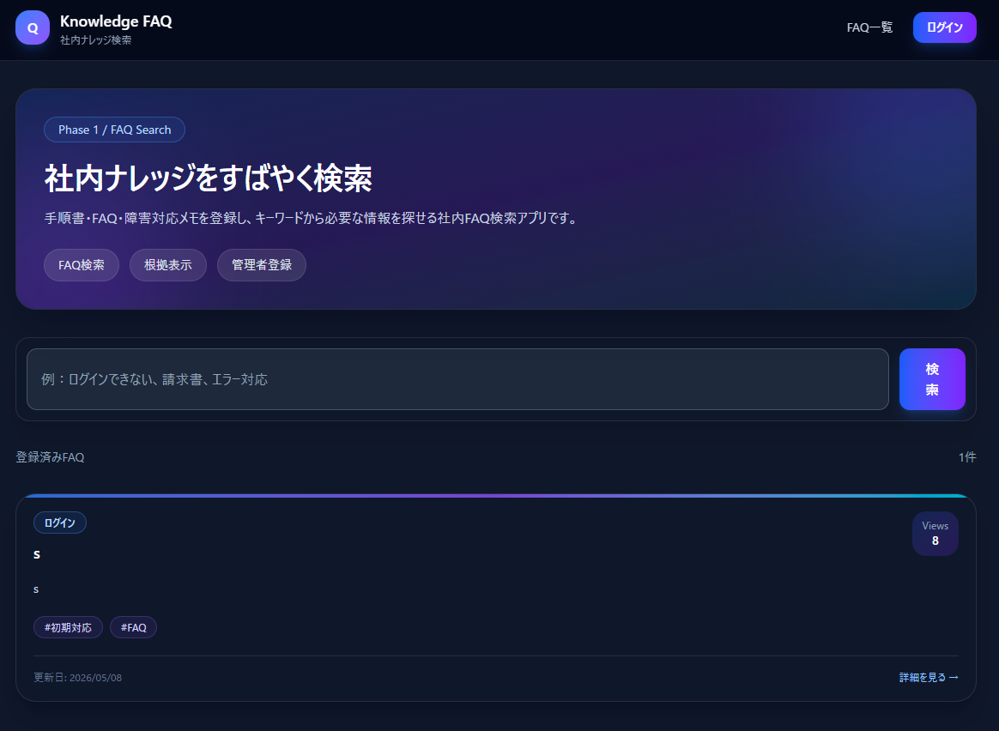
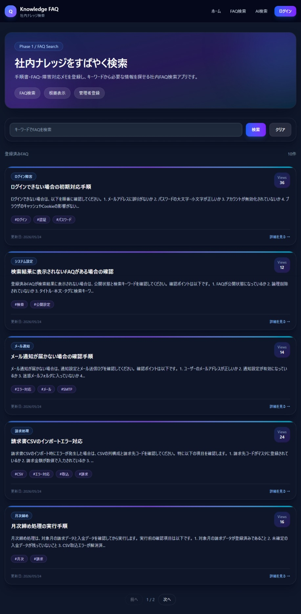
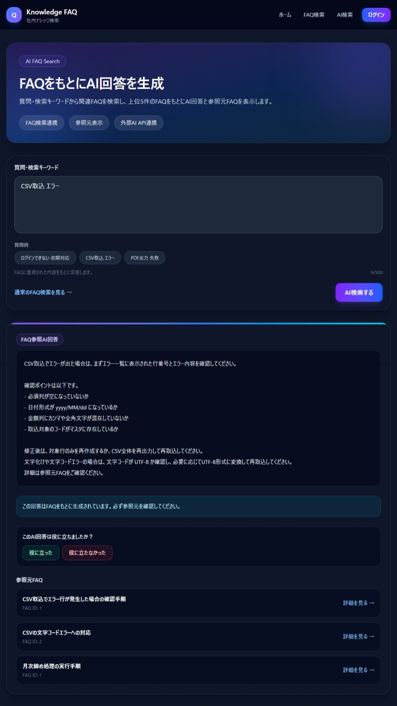
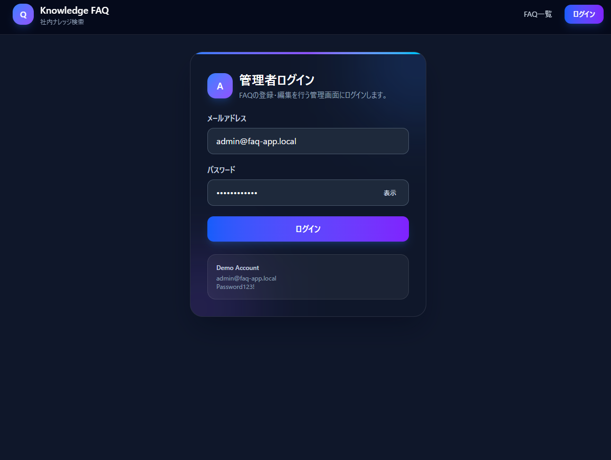
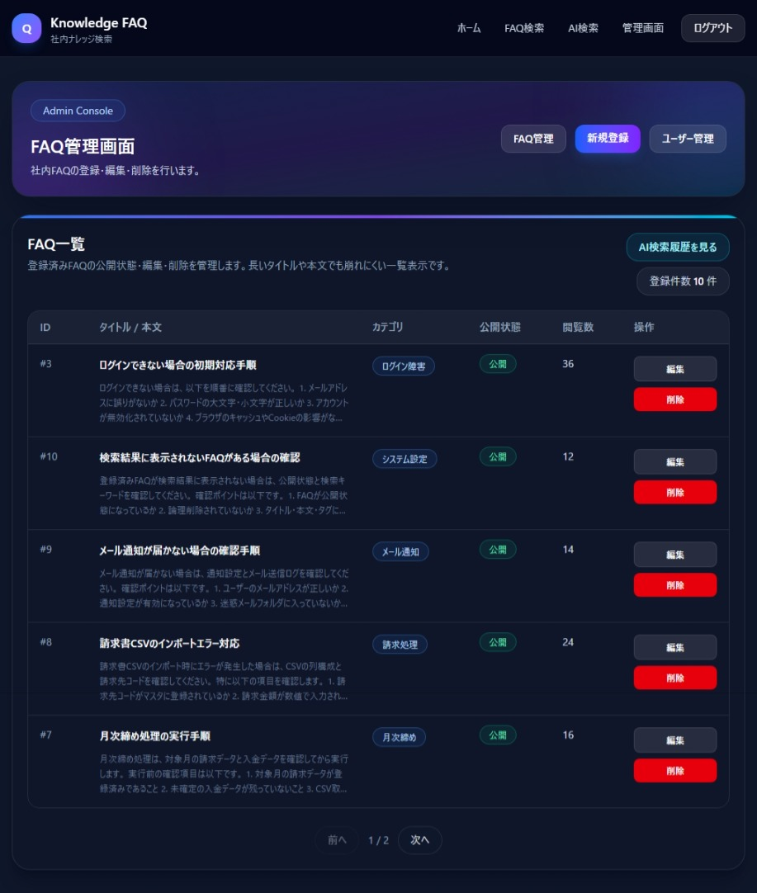
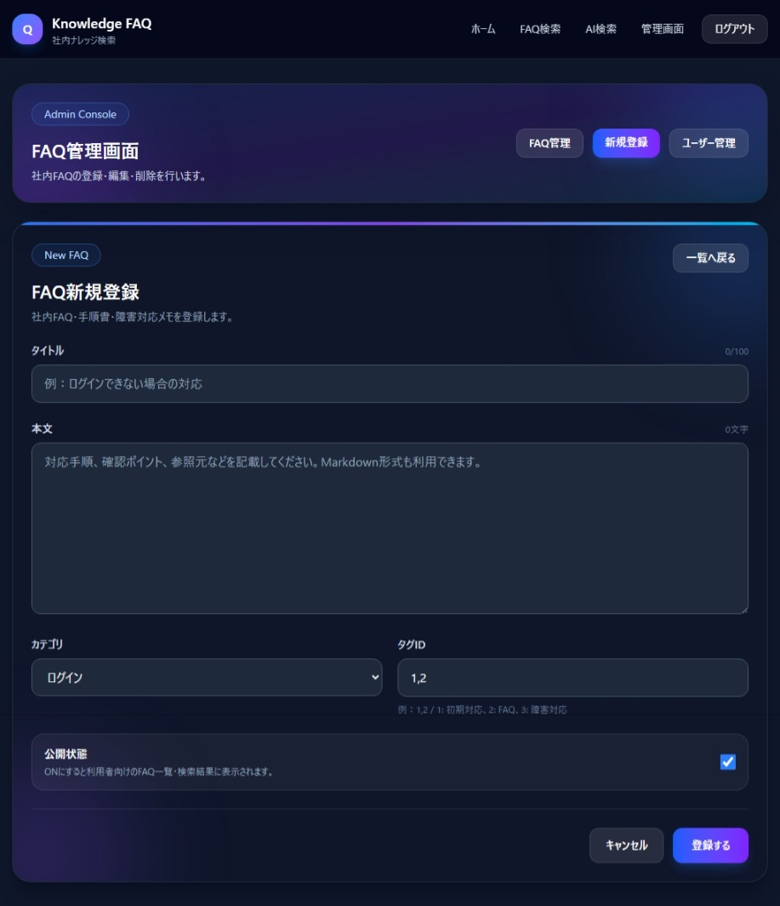
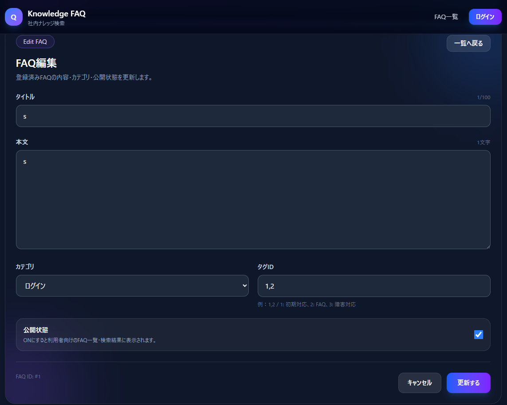
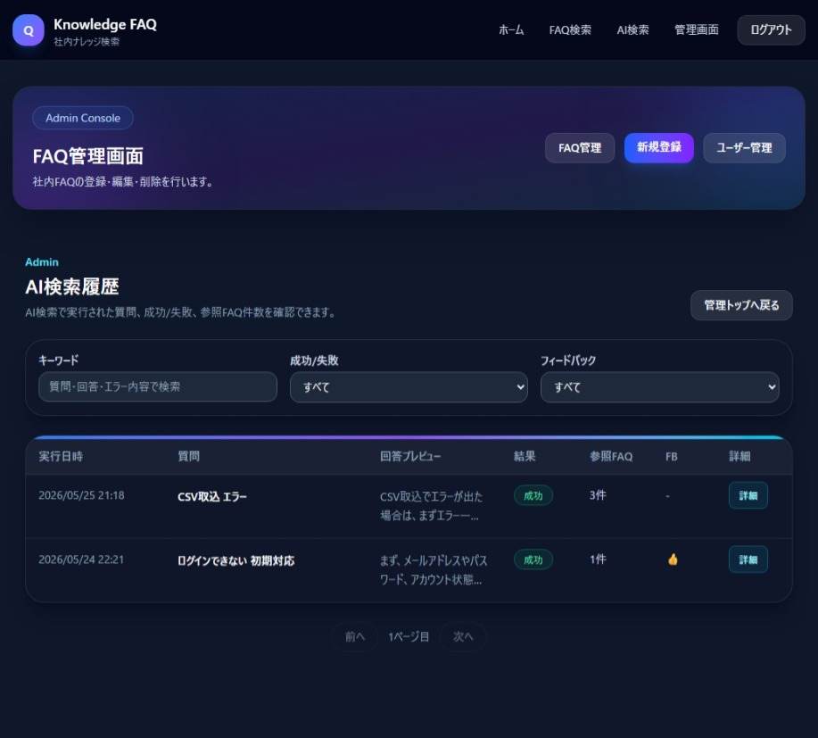
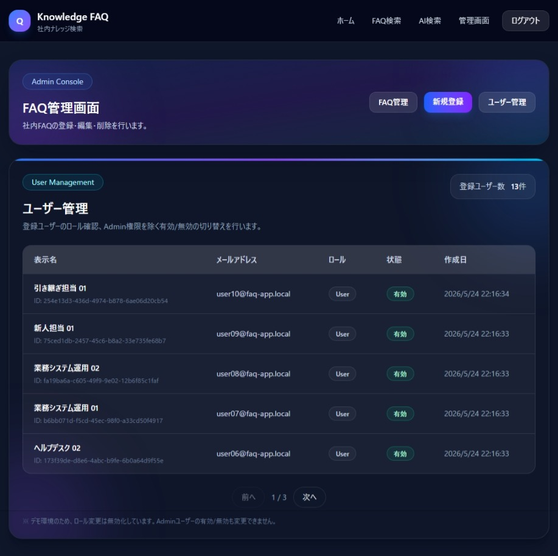

# faq-knowledge-search

[](https://github.com/fewioaghwrao/faq-knowledge-search/actions/workflows/tests.yml)
[](https://github.com/fewioaghwrao/studio-book-dotnet-next/actions/workflows/azure-static-web-apps-green-bush-0db40ef00.yml)

社内FAQ・業務ナレッジ検索アプリです。  
FAQ、手順書、障害対応メモを登録し、通常検索とAI検索の両方から必要な情報を確認できるWebアプリです。

社内業務アプリで発生しやすい問い合わせや障害対応を想定し、  
「FAQ検索」「AI回答生成」「参照元FAQ表示」「AI検索履歴管理」「ユーザー管理」までを実装しています。

---

## デモサイト

| 対象 | URL |
|---|---|
| フロントエンド | https://green-bush-0db40ef00.7.azurestaticapps.net/ |
| バックエンドAPI | https://faq-app-api-d060ab93d646.herokuapp.com/ |
| Swagger UI | https://faq-app-api-d060ab93d646.herokuapp.com/swagger |

### デモアカウント

| ロール | メールアドレス | パスワード |
|---|---|---|
| 管理者 | admin@faq-app.local | Admin1234! |

※ このアカウントはポートフォリオ確認用のデモアカウントです。

---

### バックエンドAPI確認

**Swagger UI**

```
https://faq-app-api-d060ab93d646.herokuapp.com/swagger
```

APIエンドポイントの仕様確認・動作テストが可能です。
認証が必要なエンドポイントは、ログインAPIで取得したトークンを利用して確認します。

> **注意:** Heroku のスリープにより、初回アクセス時にレスポンスが遅延することがあります。

---

## 概要

このアプリは、社内に散在しがちなFAQ、手順書、障害対応メモを一元管理し、  
必要な情報をすばやく検索・参照できるようにすることを目的としたナレッジ検索アプリです。

一般利用者は公開済みFAQを検索・閲覧できます。  
管理者はFAQの登録・編集・削除、AI検索履歴の確認、ユーザー管理を行えます。

AI検索では、質問内容をもとに関連FAQを検索し、上位FAQをコンテキストとして外部AI APIへ渡して回答を生成します。  
回答には参照元FAQを表示し、FAQにない内容を断言しないようプロンプトで制御しています。

---

## 主な機能

### 一般利用者向け

- ホーム画面
- FAQ一覧表示
- FAQ詳細表示
- キーワード検索
- カテゴリ・タグによるFAQ分類
- 公開中FAQの閲覧
- 閲覧数の表示
- AI FAQ検索
- AI回答表示
- 参照元FAQ表示
- AI回答フィードバック

### 管理者向け

- 管理者ログイン
- ログアウト確認
- FAQ管理画面
- FAQ新規登録
- FAQ編集
- FAQ削除
- 公開 / 非公開の切り替え
- AI検索履歴一覧
- AI検索履歴詳細
- AI回答フィードバック確認
- ユーザー管理
- ユーザーの有効 / 無効管理
- ユーザーロール管理

---

## 実装状況

| 機能                  | 状態       | 補足                           |
| --------------------- | ---------- | ------------------------------ |
| FAQ一覧・検索         | 実装済み   | キーワード検索、FAQカード表示  |
| FAQ詳細               | 実装済み   | FAQ本文、カテゴリ、タグ、閲覧数を表示 |
| FAQ新規登録           | 実装済み   | 管理画面から登録               |
| FAQ編集               | 実装済み   | 管理画面から編集               |
| FAQ削除               | 実装済み   | 管理画面から削除               |
| 公開 / 非公開管理     | 実装済み   | FAQごとに公開状態を切り替え    |
| 管理者ログイン        | 実装済み   | JWT認証                        |
| ログアウト確認        | 実装済み   | 確認ダイアログあり             |
| AI FAQ検索            | 実装済み   | FAQをコンテキストにAI回答を生成 |
| 外部AI API連携        | 実装済み   | APIキー・Endpoint・Modelを設定してOpenAI APIを呼び出し |
| 参照元FAQ表示         | 実装済み   | AI回答の根拠FAQを表示          |
| AI検索履歴一覧        | 実装済み   | 管理画面で履歴を確認           |
| AI検索履歴詳細        | 実装済み   | 質問、回答、参照元FAQを確認    |
| AI回答フィードバック  | 実装済み   | 役に立った / 役に立たなかったを記録 |
| ユーザー管理          | 実装済み   | ユーザー一覧、状態管理         |
| バックエンドテスト    | 実装済み   | Controller / Service のテスト  |
| フロントエンドテスト  | 実装済み   | Page / Component / lib のテスト |
| フロントエンドデプロイ | 実装済み  | Azure Static Web Apps          |
| バックエンドデプロイ  | 実装済み   | Heroku                         |
| CSVインポート         | 今後の拡張 | 設計・拡張候補                 |
| ファイルアップロード  | 今後の拡張 | 設計・拡張候補                 |
| Slack / Teams通知     | 今後の拡張 | 設計・拡張候補                 |
| 管理ダッシュボード    | 今後の拡張 | 設計・拡張候補                 |

---

## 画面イメージ

### ホーム画面



### 通常FAQ検索



### AI FAQ検索



### 管理者ログイン



### FAQ管理画面



### FAQ新規登録



### FAQ編集



### AI検索履歴



### ユーザー管理



---

## 使用技術

### Frontend

- Next.js
- React
- TypeScript
- CSS / Tailwind CSS
- Jest
- React Testing Library
- Azure Static Web Apps

### Backend

- ASP.NET Core Web API
- C#
- Entity Framework Core
- ASP.NET Core Identity
- JWT認証
- xUnit
- OpenAI API連携
- Heroku

### Database

- MySQL
- Entity Framework Core Migrations

### DevOps / Tools

- GitHub Actions
- Docker
- Git / GitHub

---

## アーキテクチャ概要

```text
[User Browser]
      |
      v
[Next.js Frontend]
Azure Static Web Apps
      |
      | REST API
      v
[ASP.NET Core Web API]
Heroku
      |
      | EF Core
      v
[Database]
MySQL
      |
      | FAQ Context
      v
[OpenAI API]
```

本システムは、フロントエンド・バックエンドAPI・データベースを分離した構成です。  
AI検索では、バックエンド側でFAQ検索を行い、関連FAQをコンテキストとして外部AI APIへ送信します。

### AI検索の特徴

AI検索では、単に質問文をAIへ送るのではなく、以下の流れで回答を生成します。

1. ユーザーが質問を入力
2. バックエンドで関連FAQを検索
3. 上位FAQをAIコンテキストとして整形
4. OpenAI APIへ送信
5. FAQに基づいた回答を生成
6. 回答と参照元FAQを画面に表示
7. AI検索履歴として保存

### ガードレール

AI回答では、以下の制御を行っています。

- 提供されたFAQコンテキストのみを根拠に回答
- FAQに記載されていない内容は断言しない
- FAQにない手順・原因・担当部署・問い合わせ先を推測しない
- 機密情報、個人情報、認証情報を出力しない
- 回答末尾に参照元FAQ確認を促す文言を付与

---

## 主なディレクトリ構成

```text
faq-knowledge-search
├── backend
│   ├── FaqApp.Api
│   │   ├── Controller
│   │   ├── Data
│   │   ├── Dtos
│   │   ├── Entities
│   │   ├── Migrations
│   │   ├── Services
│   │   ├── Settings
│   │   └── Program.cs
│   │
│   └── FaqApp.Api.Tests
│       ├── Controllers
│       └── Services
│
├── faq-app-frontend
│   ├── src
│   │   ├── app
│   │   ├── components
│   │   ├── lib
│   │   └── types
│   ├── package.json
│   └── next.config.ts
│
├── docs
│   ├── design
│   ├── requirements
│   └── images
│
├── .github
│   └── workflows
│
├── Dockerfile
├── docker-compose.yml
└── README.md
```

### バックエンド主要構成

**Controllers**

- AuthController
- FaqsController
- AiController
- UsersController

**Services**

- AuthService
- FaqService
- AiService
- AiApiClient
- AiSearchHistoryService
- UserService

**Entities**

- ApplicationUser
- Faq
- Category
- Tag
- AiSearchHistory
- AiSearchHistorySource

### フロントエンド主要画面

| URL                          | 画面              |
| ---------------------------- | ----------------- |
| `/`                          | ホーム画面        |
| `/faqs`                      | FAQ検索           |
| `/faqs/[id]`                 | FAQ詳細           |
| `/ai-search`                 | AI FAQ検索        |
| `/login`                     | 管理者ログイン    |
| `/admin`                     | 管理画面          |
| `/admin/faqs/new`            | FAQ新規登録       |
| `/admin/faqs/[id]/edit`      | FAQ編集           |
| `/admin/ai-histories`        | AI検索履歴一覧    |
| `/admin/ai-histories/[id]`   | AI検索履歴詳細    |
| `/admin/users`               | ユーザー管理      |

---

## 認証・認可

管理者向け機能にはJWT認証を導入しています。

- ログイン成功時にJWTを発行
- 管理画面は認証済みユーザーのみ利用可能
- FAQ登録・編集・削除は管理者権限で制御
- ユーザー管理は管理者向け機能として提供
- 無効化されたユーザーはログイン不可

---

## データベース設計

主なテーブルは以下です。

- Faqs
- Categories
- Tags
- AiSearchHistories
- AiSearchHistorySources
- AspNetUsers
- AspNetRoles
- AspNetUserRoles

FAQとタグは多対多の関係です。  
AI検索履歴は、質問・AI回答・成否・フィードバック・参照元FAQを保持します。  
認証関連テーブルは ASP.NET Core Identity により管理しています。

---

## テスト

### Backend

```bash
cd backend
dotnet test
```

### Frontend

```bash
cd faq-app-frontend
npm test -- --watchAll=false
```

バックエンドでは Controller / Service の単体テストを実装しています。  
フロントエンドでは Page / Component / lib のテストを実装しています。

---

## ローカル起動

### Backend

```bash
cd backend/FaqApp.Api
dotnet restore
dotnet ef database update
dotnet run
```

### Frontend

```bash
cd faq-app-frontend
npm install
npm run dev
```

---

## 環境変数・設定

### Backend

AI API連携を利用する場合は、以下を設定します。

```json
{
  "AiSettings": {
    "ApiKey": "your-api-key",
    "Endpoint": "your-api-endpoint",
    "Model": "your-model"
  }
}
```

> 実運用では、APIキーを `appsettings.json` に直接記載せず、User Secrets またはホスティング環境の環境変数で管理します。

### Frontend

```env
NEXT_PUBLIC_API_BASE_URL=https://faq-app-api-d060ab93d646.herokuapp.com
```

---

## ドキュメント

| 種別 | ファイル |
|---|---|
| アーキテクチャ | [docs/design/architecture.md](docs/design/architecture.md) |
| 要件定義 | [docs/requirements/requirements.md](docs/requirements/requirements.md) |
| 基本設計 | [docs/design/basic-design.md](docs/design/basic-design.md) |
| 詳細設計 | [docs/design/detail-design.md](docs/design/detail-design.md) |
| ER図 | [docs/diagrams/faq_app_ERD.drawio.png](docs/diagrams/faq_app_ERD.drawio.png) |
| 画面遷移図（一般利用者） | [docs/diagrams/state-transition-user.drawio.png](docs/diagrams/state-transition-user.drawio.png) |
| 画面遷移図（管理者） | [docs/diagrams/state-transition-admin.drawio.png](docs/diagrams/state-transition-admin.drawio.png) |
| 画面イメージ | [docs/images/](docs/images/) |
| Backend README | [backend/README.md](backend/README.md) |
| Frontend README | [faq-app-frontend/README.md](faq-app-frontend/README.md) |

---

## 今後の拡張候補

- CSVインポート
- ファイルアップロード
- Slack / Teams通知
- FAQ改善提案
- 管理ダッシュボード
- カテゴリ別アクセス統計
- 検索サジェスト
- よく見られているFAQ表示
- FAQ本文のMarkdown表示強化

---

## 備考

本アプリはポートフォリオ用途として作成しています。  
実務で扱うような社内FAQ、手順書、障害対応ナレッジの管理を想定し、  
FAQ検索、AI検索、管理機能、デプロイ、テストまでを含む業務アプリとして構成しています。