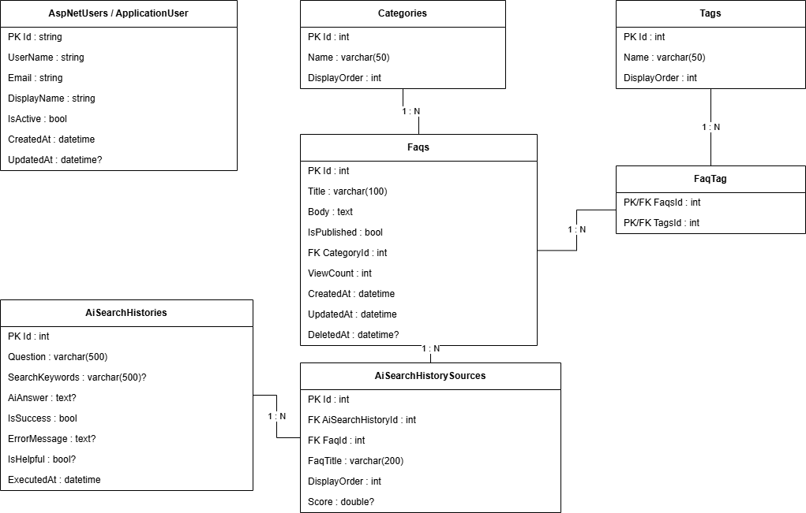
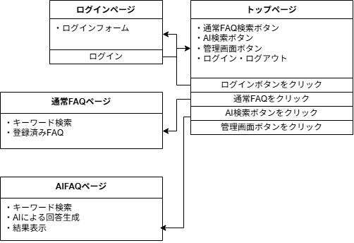
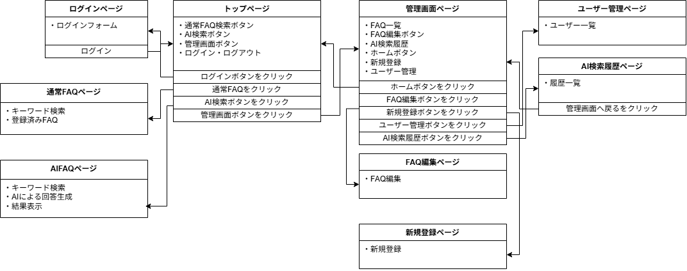

# 詳細設計書 — 社内FAQ・業務ナレッジ検索アプリ
**FAQ Knowledge Search**

| 項目 | 内容 |
|------|------|
| プロジェクト名 | 社内FAQ・業務ナレッジ検索アプリ |
| ドキュメント種別 | 詳細設計書 |
| バージョン | 1.1 |
| 作成日 | 2026/05/09 |
| 更新日 | 2026/05/28 |
| 作成者 | — |
| 承認者 | — |

## 改訂履歴

| バージョン | 日付 | 変更内容 | 作成者 |
|-----------|------|---------|--------|
| 1.0 | 2026/05/09 | 初版作成 | — |
| 1.1 | 2026/05/28 | 現行実装に合わせて修正。MySQL、OpenAI API、AiSearchHistory、Heroku / Azure Static Web Apps構成へ整理 | — |

---

## 1. 本書の目的

本書は、社内FAQ・業務ナレッジ検索アプリの詳細設計をまとめることを目的とする。

本アプリは、社内業務アプリで発生しやすい操作手順、障害対応、APIエラー、CSV取込、PDF出力、メール通知、月次処理などのFAQを一元管理し、通常検索およびAI FAQ検索から必要な情報を参照できるWebアプリである。

---

## 2. システム概要

### 2.1 アプリ概要

本アプリは、以下の機能を提供する。

- FAQ一覧表示
- FAQ詳細表示
- キーワード検索
- FAQ新規登録
- FAQ編集
- FAQ削除
- FAQ公開 / 非公開管理
- JWT認証
- 管理者ログイン
- AI FAQ検索
- 参照元FAQ表示
- AI検索履歴管理
- AI回答フィードバック
- ユーザー管理
- ユーザー有効 / 無効管理
- バックエンドテスト
- フロントエンドテスト
- フロントエンドデプロイ
- バックエンドデプロイ

### 2.2 現在のデモ環境

| 区分 | 内容 |
|------|------|
| Frontend | Next.js / React / TypeScript |
| Frontend Hosting | Azure Static Web Apps |
| Backend | ASP.NET Core Web API / C# |
| Backend Hosting | Heroku |
| Database | MySQL |
| ORM | Entity Framework Core |
| Authentication | JWT認証 / ASP.NET Core Identity |
| AI | OpenAI API |
| CI/CD | GitHub Actions |

### 2.3 システム構成

```
[User Browser]
      |
      v
[Next.js Frontend]
Azure Static Web Apps
      |
      | REST API / JSON
      v
[ASP.NET Core Web API]
Heroku
      |
      | Entity Framework Core
      v
[MySQL Database]
      |
      | FAQ Context
      v
[OpenAI API]
```

---

## 3. 実装範囲

### 3.1 実装済み機能

| 機能 | 状態 | 補足 |
|------|------|------|
| FAQ一覧・検索 | 実装済み | キーワード検索、FAQカード表示 |
| FAQ詳細 | 実装済み | FAQ本文、カテゴリ、タグ、閲覧数を表示 |
| FAQ新規登録 | 実装済み | 管理画面から登録 |
| FAQ編集 | 実装済み | 管理画面から編集 |
| FAQ削除 | 実装済み | 管理画面から削除 |
| 公開 / 非公開管理 | 実装済み | FAQごとに公開状態を切り替え |
| 管理者ログイン | 実装済み | JWT認証 |
| ログアウト確認 | 実装済み | 確認ダイアログあり |
| AI FAQ検索 | 実装済み | FAQをコンテキストにAI回答を生成 |
| 外部AI API連携 | 実装済み | OpenAI APIを呼び出し |
| 参照元FAQ表示 | 実装済み | AI回答の根拠FAQを表示 |
| AI検索履歴一覧 | 実装済み | 管理画面で確認 |
| AI検索履歴詳細 | 実装済み | 質問、回答、参照元FAQを確認 |
| AI回答フィードバック | 実装済み | 役に立った / 役に立たなかったを記録 |
| ユーザー管理 | 実装済み | ユーザー一覧、状態管理 |
| バックエンドテスト | 実装済み | Controller / Service のテスト |
| フロントエンドテスト | 実装済み | Page / Component / lib のテスト |
| フロントエンドデプロイ | 実装済み | Azure Static Web Apps |
| バックエンドデプロイ | 実装済み | Heroku |

### 3.2 今後の拡張候補

| 機能 | 状態 | 補足 |
|------|------|------|
| CSVインポート | 今後の拡張 | FAQ一括登録 |
| ファイルアップロード | 今後の拡張 | 手順書・添付資料管理 |
| Slack / Teams通知 | 今後の拡張 | FAQ更新通知など |
| 管理ダッシュボード | 今後の拡張 | 利用状況可視化 |
| カテゴリ別アクセス統計 | 今後の拡張 | FAQ改善分析 |
| 検索サジェスト | 今後の拡張 | UX改善 |
| よく見られているFAQ表示 | 今後の拡張 | トップページ強化 |
| FAQ本文のMarkdown表示強化 | 今後の拡張 | 表現力向上 |
| 通常検索履歴 | 今後の拡張 | AI検索履歴とは別管理 |
| Editorロール | 今後の拡張 | 管理者以外の編集権限 |

---

## 4. アプリケーション構成

### 4.1 ディレクトリ構成

```
faq-knowledge-search
├── backend
│   ├── FaqApp.Api
│   │   ├── Controller
│   │   ├── Data
│   │   ├── Dtos
│   │   ├── Entities
│   │   ├── Migrations
│   │   ├── Services
│   │   ├── Settings
│   │   └── Program.cs
│   │
│   └── FaqApp.Api.Tests
│       ├── Controllers
│       └── Services
│
├── faq-app-frontend
│   ├── src
│   │   ├── app
│   │   ├── components
│   │   ├── lib
│   │   └── types
│   ├── package.json
│   └── next.config.ts
│
├── docs
│   ├── design
│   ├── requirements
│   └── images
│
├── .github
│   └── workflows
│
├── Dockerfile
├── docker-compose.yml
└── README.md
```

### 4.2 バックエンド構成

```
Controller
  ↓
Service
  ↓
DbContext / Entity
  ↓
MySQL
```

| 層 | 主な責務 |
|----|---------|
| Controller | APIエンドポイント、HTTPリクエスト受信、認証・認可、レスポンス返却 |
| Service | FAQ検索、AI回答生成、AI履歴保存、ユーザー管理などの業務ロジック |
| DTO | APIの入出力モデル |
| Entity | DB永続化モデル |
| DbContext | Entity Framework Core によるDB操作 |
| Migrations | DBスキーマ管理 |
| Tests | Controller / Service の単体テスト |

### 4.3 フロントエンド構成

| ディレクトリ | 役割 |
|------------|------|
| src/app | App Router のページ・ルーティング |
| src/components | 共通コンポーネント |
| src/lib | API通信などの共通処理 |
| src/types | APIレスポンスや画面表示用の型定義 |

---

## 5. データベース詳細設計

### 5.1 主なテーブル

| テーブル | 概要 |
|---------|------|
| Faqs | FAQ本文、公開状態、カテゴリ、閲覧数など |
| Categories | FAQカテゴリ |
| Tags | FAQタグ |
| FaqTag | FAQとタグの中間テーブル |
| AiSearchHistories | AI検索履歴 |
| AiSearchHistorySources | AI回答に利用した参照元FAQ |
| AspNetUsers | ASP.NET Core Identity のユーザー |
| AspNetRoles | ASP.NET Core Identity のロール |
| AspNetUserRoles | ユーザーとロールの関連 |

### 5.2 ER図



### 5.3 テーブル定義

#### 5.3.1 AspNetUsers / ApplicationUser

| カラム | 型 | 必須 | 概要 |
|-------|-----|------|------|
| Id | string | ○ | ユーザーID |
| UserName | string | ○ | ユーザー名 |
| Email | string | ○ | メールアドレス |
| DisplayName | string | ○ | 表示名 |
| IsActive | bool | ○ | 有効 / 無効 |
| CreatedAt | datetime | ○ | 作成日時 |
| UpdatedAt | datetime? | — | 更新日時 |

**備考**
- ASP.NET Core Identity のユーザーテーブルを拡張する。
- `IsActive = false` のユーザーはログイン不可とする。
- ユーザー管理画面では、ユーザー一覧と有効 / 無効状態を管理する。

#### 5.3.2 Categories

| カラム | 型 | 必須 | 概要 |
|-------|-----|------|------|
| Id | int | ○ | カテゴリID |
| Name | varchar(50) | ○ | カテゴリ名 |
| DisplayOrder | int | ○ | 表示順 |

**備考**
- FAQを業務領域ごとに分類する。
- 例：ログイン、CSV取込、PDF出力、APIエラー、月次処理など。

#### 5.3.3 Tags

| カラム | 型 | 必須 | 概要 |
|-------|-----|------|------|
| Id | int | ○ | タグID |
| Name | varchar(50) | ○ | タグ名 |
| DisplayOrder | int | ○ | 表示順 |

**備考**
- FAQに複数タグを紐づける。
- FAQとタグは多対多の関係とする。

#### 5.3.4 Faqs

| カラム | 型 | 必須 | 概要 |
|-------|-----|------|------|
| Id | int | ○ | FAQ ID |
| Title | varchar(100) | ○ | FAQタイトル |
| Body | text | ○ | FAQ本文 |
| CategoryId | int | ○ | カテゴリID |
| IsPublished | bool | ○ | 公開状態 |
| ViewCount | int | ○ | 閲覧数 |
| CreatedAt | datetime | ○ | 作成日時 |
| UpdatedAt | datetime | ○ | 更新日時 |
| DeletedAt | datetime? | — | 論理削除日時 |

**備考**
- `DeletedAt` が null のデータを有効データとして扱う。
- 一般利用者には `IsPublished = true` のFAQのみ表示する。
- 管理者は公開 / 非公開を問わずFAQを管理できる。
- FAQ詳細表示時に `ViewCount` を加算する。

#### 5.3.5 FaqTag

| カラム | 型 | 必須 | 概要 |
|-------|-----|------|------|
| FaqId | int | ○ | FAQ ID |
| TagId | int | ○ | タグID |

**備考**
- FAQとタグの多対多を表現する中間テーブル。
- 主キーは `FaqId` と `TagId` の複合キーとする。

#### 5.3.6 AiSearchHistories

| カラム | 型 | 必須 | 概要 |
|-------|-----|------|------|
| Id | int | ○ | AI検索履歴ID |
| Question | varchar(500) | ○ | ユーザーの質問 |
| SearchKeywords | varchar(500)? | — | 検索に利用したキーワード |
| AiAnswer | text? | — | AI回答 |
| IsSuccess | bool | ○ | 成功 / 失敗 |
| ErrorMessage | text? | — | エラー内容 |
| IsHelpful | bool? | — | フィードバック |
| ExecutedAt | datetime | ○ | 実行日時 |

**備考**
- AI検索の実行履歴を保存する。
- AI回答に失敗した場合も履歴として保存する。
- `IsHelpful` の意味：

| 値 | 意味 |
|----|------|
| true | 役に立った |
| false | 役に立たなかった |
| null | 未評価 |

#### 5.3.7 AiSearchHistorySources

| カラム | 型 | 必須 | 概要 |
|-------|-----|------|------|
| Id | int | ○ | AI検索履歴参照元ID |
| AiSearchHistoryId | int | ○ | AI検索履歴ID |
| FaqId | int | ○ | 参照元FAQ ID |
| FaqTitle | varchar(200) | ○ | 参照元FAQタイトル |
| DisplayOrder | int | ○ | 表示順 |
| Score | double? | — | 関連度スコア |

**備考**
- AI回答の根拠として利用したFAQを保存する。
- FAQのタイトルは履歴確認時に表示しやすいよう保持する。
- `DisplayOrder` により、AI回答時に利用した参照元FAQの順番を保持する。

---

## 6. Entity詳細設計

### 6.1 ApplicationUser

| プロパティ | 型 | 概要 |
|----------|-----|------|
| Id | string | Identity標準 |
| UserName | string | Identity標準 |
| Email | string | Identity標準 |
| DisplayName | string | 表示名 |
| IsActive | bool | 有効 / 無効 |
| CreatedAt | DateTime | 作成日時 |
| UpdatedAt | DateTime? | 更新日時 |

**主な処理**

| 処理 | 内容 |
|------|------|
| 有効状態確認 | ログイン時に IsActive を確認 |
| 状態更新 | 管理者が有効 / 無効を切り替える |
| 更新日時設定 | 状態変更時に UpdatedAt を更新 |

### 6.2 Faq

| プロパティ | 型 | 概要 |
|----------|-----|------|
| Id | int | FAQ ID |
| Title | string | タイトル |
| Body | string | 本文 |
| CategoryId | int | カテゴリID |
| IsPublished | bool | 公開状態 |
| ViewCount | int | 閲覧数 |
| CreatedAt | DateTime | 作成日時 |
| UpdatedAt | DateTime | 更新日時 |
| DeletedAt | DateTime? | 論理削除日時 |
| Category | Category | カテゴリ |
| FaqTags | ICollection\<FaqTag\> | タグ関連 |

**主な処理**

| 処理 | 内容 |
|------|------|
| Create | FAQを新規作成する |
| Update | FAQのタイトル、本文、カテゴリ、公開状態を更新する |
| Delete | DeletedAt を設定して論理削除する |
| IncrementViewCount | FAQ詳細表示時に閲覧数を加算する |

### 6.3 Category

| プロパティ | 型 | 概要 |
|----------|-----|------|
| Id | int | カテゴリID |
| Name | string | カテゴリ名 |
| DisplayOrder | int | 表示順 |
| Faqs | ICollection\<Faq\> | FAQ一覧 |

### 6.4 Tag

| プロパティ | 型 | 概要 |
|----------|-----|------|
| Id | int | タグID |
| Name | string | タグ名 |
| DisplayOrder | int | 表示順 |
| FaqTags | ICollection\<FaqTag\> | FAQ関連 |

### 6.5 FaqTag

| プロパティ | 型 | 概要 |
|----------|-----|------|
| FaqId | int | FAQ ID |
| TagId | int | タグID |
| Faq | Faq | FAQ |
| Tag | Tag | タグ |

### 6.6 AiSearchHistory

| プロパティ | 型 | 概要 |
|----------|-----|------|
| Id | int | AI検索履歴ID |
| Question | string | 質問 |
| SearchKeywords | string? | 検索キーワード |
| AiAnswer | string? | AI回答 |
| IsSuccess | bool | 成功 / 失敗 |
| ErrorMessage | string? | エラー内容 |
| IsHelpful | bool? | フィードバック |
| ExecutedAt | DateTime | 実行日時 |
| Sources | ICollection\<AiSearchHistorySource\> | 参照元FAQ |

**主な処理**

| 処理 | 内容 |
|------|------|
| CreateSuccess | AI検索成功履歴を作成する |
| CreateFailure | AI検索失敗履歴を作成する |
| SetFeedback | AI回答へのフィードバックを保存する |

### 6.7 AiSearchHistorySource

| プロパティ | 型 | 概要 |
|----------|-----|------|
| Id | int | ID |
| AiSearchHistoryId | int | AI検索履歴ID |
| FaqId | int | FAQ ID |
| FaqTitle | string | FAQタイトル |
| DisplayOrder | int | 表示順 |
| Score | double? | 関連度スコア |
| AiSearchHistory | AiSearchHistory | AI検索履歴 |
| Faq | Faq | FAQ |

---

## 7. DbContext詳細設計

### 7.1 DbSet

| DbSet | 対象Entity |
|-------|-----------|
| Faqs | Faq |
| Categories | Category |
| Tags | Tag |
| FaqTags | FaqTag |
| AiSearchHistories | AiSearchHistory |
| AiSearchHistorySources | AiSearchHistorySource |

### 7.2 リレーション設定

| 関係 | 内容 |
|------|------|
| Category 1 : N Faq | 1カテゴリに複数FAQ |
| Faq N : N Tag | FaqTagを介して多対多 |
| AiSearchHistory 1 : N AiSearchHistorySource | 1回のAI検索に複数参照元FAQ |
| Faq 1 : N AiSearchHistorySource | 1FAQが複数AI検索履歴で参照される |
| AspNetUsers N : N AspNetRoles | Identity標準 |

### 7.3 削除方針

| 対象 | 方針 |
|------|------|
| Faq | 論理削除 |
| Category | FAQが紐づく場合は削除不可 |
| Tag | FAQが紐づく場合は削除不可、または関連解除後に削除 |
| AiSearchHistory | 物理削除は原則行わない |
| AiSearchHistorySource | AiSearchHistory削除時は連動削除可能 |
| ApplicationUser | 原則削除せず IsActive で無効化 |

### 7.4 MySQL向け日時方針

| 項目 | 方針 |
|------|------|
| 作成日時 | アプリケーション側で `DateTime.UtcNow` を設定 |
| 更新日時 | 更新処理時に `DateTime.UtcNow` を設定 |
| DBデフォルト | MySQL向けには `CURRENT_TIMESTAMP` 相当を利用可能 |
| タイムゾーン | 基本はUTCで保存し、画面表示時に必要に応じて整形 |

---

## 8. API詳細設計

### 8.1 認証API

#### `POST /api/auth/login`

管理者ログインを行う。

**Request**

| 項目 | 型 | 必須 | 内容 |
|------|-----|------|------|
| email | string | ○ | メールアドレス |
| password | string | ○ | パスワード |

**Response**

| 項目 | 型 | 内容 |
|------|-----|------|
| accessToken | string | JWT |
| expiresIn | number | 有効期限秒数 |
| role | string | ロール |
| displayName | string | 表示名 |

**エラー**

| HTTP | 内容 |
|------|------|
| 401 | メールアドレスまたはパスワード不正 |
| 403 | ユーザー無効 |

#### `POST /api/auth/logout`

ログアウト処理を行う。

**Response**

| 項目 | 型 | 内容 |
|------|-----|------|
| message | string | ログアウト完了メッセージ |

### 8.2 FAQ API

#### `GET /api/faqs`

FAQ一覧を取得する。

**Query Parameters**

| 項目 | 型 | 必須 | 内容 |
|------|-----|------|------|
| keyword | string | — | 検索キーワード |
| categoryId | int | — | カテゴリID |
| tagId | int | — | タグID |
| page | int | — | ページ番号 |
| pageSize | int | — | 1ページ件数 |
| sort | string | — | updatedAt / score |
| highlight | bool | — | ハイライト有無 |

**Response**

| 項目 | 型 | 内容 |
|------|-----|------|
| total | number | 総件数 |
| page | number | 現在ページ |
| pageSize | number | 1ページ件数 |
| items | FaqListItem[] | FAQ一覧 |

#### `GET /api/faqs/{id}`

FAQ詳細を取得する。

**Response**

| 項目 | 型 | 内容 |
|------|-----|------|
| id | number | FAQ ID |
| title | string | タイトル |
| body | string | 本文 |
| categoryName | string | カテゴリ名 |
| tags | Tag[] | タグ |
| isPublished | bool | 公開状態 |
| viewCount | number | 閲覧数 |
| createdAt | string | 作成日時 |
| updatedAt | string | 更新日時 |

#### `POST /api/faqs`

FAQを新規登録する。

> **認可：** 管理者のみ実行可能。

**Request**

| 項目 | 型 | 必須 | 内容 |
|------|-----|------|------|
| title | string | ○ | タイトル |
| body | string | ○ | 本文 |
| categoryId | int | ○ | カテゴリID |
| tagIds | int[] | — | タグID一覧 |
| isPublished | bool | ○ | 公開状態 |

#### `PUT /api/faqs/{id}`

FAQを更新する。

> **認可：** 管理者のみ実行可能。

#### `DELETE /api/faqs/{id}`

FAQを削除する。

> **認可：** 管理者のみ実行可能。
> **備考：** 実体は論理削除とし、`DeletedAt` を設定する。

### 8.3 AI API

#### `POST /api/ai/search`

AI FAQ検索を実行する。

**Request**

| 項目 | 型 | 必須 | 内容 |
|------|-----|------|------|
| question | string | ○ | ユーザーの質問 |

**Response**

| 項目 | 型 | 内容 |
|------|-----|------|
| answer | string? | AI回答 |
| disclaimer | string? | 注意文 |
| sources | AiSource[] | 参照元FAQ |
| message | string? | 補足メッセージ |
| aiHistoryId | number | AI検索履歴ID |

**処理概要**

1. 質問文を受け取る。
2. 質問文から検索キーワードを抽出する。
3. FAQ検索を実行する。
4. 上位FAQをAIコンテキストとして整形する。
5. OpenAI APIへ送信する。
6. AI回答を受け取る。
7. AI検索履歴を保存する。
8. 回答と参照元FAQを返却する。

#### `POST /api/ai/histories/{id}/feedback`

AI回答へのフィードバックを登録する。

**Request**

| 項目 | 型 | 必須 | 内容 |
|------|-----|------|------|
| isHelpful | bool | ○ | 役に立ったか |

#### `GET /api/ai/histories`

AI検索履歴一覧を取得する。

> **認可：** 管理者のみ実行可能。

**Response**

| 項目 | 型 | 内容 |
|------|-----|------|
| total | number | 総件数 |
| page | number | 現在ページ |
| pageSize | number | 1ページ件数 |
| items | AiSearchHistoryListItem[] | 履歴一覧 |

#### `GET /api/ai/histories/{id}`

AI検索履歴詳細を取得する。

> **認可：** 管理者のみ実行可能。

### 8.4 ユーザー管理API

#### `GET /api/users`

ユーザー一覧を取得する。

> **認可：** 管理者のみ実行可能。

#### `PUT /api/users/{id}/status`

ユーザーの有効 / 無効を切り替える。

**Request**

| 項目 | 型 | 必須 | 内容 |
|------|-----|------|------|
| isActive | bool | ○ | 有効状態 |

**制約：** 自分自身を無効化することはできない。

#### `PUT /api/users/{id}/role`

ユーザーロールを変更する。

**Request**

| 項目 | 型 | 必須 | 内容 |
|------|-----|------|------|
| role | string | ○ | 変更後ロール |

**備考：** 現行では主に Admin / User を想定する。Editor は今後の拡張候補とする。

---

## 9. DTO詳細設計

### 9.1 FAQ DTO

#### FaqListItemDto

| 項目 | 型 | 内容 |
|------|-----|------|
| id | int | FAQ ID |
| title | string | タイトル |
| titleHighlighted | string? | ハイライト済みタイトル |
| bodyExcerpt | string? | 本文抜粋 |
| categoryId | int | カテゴリID |
| categoryName | string | カテゴリ名 |
| tags | TagDto[] | タグ |
| isPublished | bool | 公開状態 |
| viewCount | int | 閲覧数 |
| score | double? | 検索スコア |
| updatedAt | DateTime | 更新日時 |

#### FaqDetailDto

| 項目 | 型 | 内容 |
|------|-----|------|
| id | int | FAQ ID |
| title | string | タイトル |
| body | string | 本文 |
| categoryId | int | カテゴリID |
| categoryName | string | カテゴリ名 |
| tags | TagDto[] | タグ |
| isPublished | bool | 公開状態 |
| viewCount | int | 閲覧数 |
| createdAt | DateTime | 作成日時 |
| updatedAt | DateTime | 更新日時 |

#### FaqCreateRequest / FaqUpdateRequest

| 項目 | 型 | 必須 | 内容 |
|------|-----|------|------|
| title | string | ○ | タイトル |
| body | string | ○ | 本文 |
| categoryId | int | ○ | カテゴリID |
| tagIds | int[] | — | タグID一覧 |
| isPublished | bool | ○ | 公開状態 |

### 9.2 AI DTO

#### AiSearchRequest

| 項目 | 型 | 必須 | 内容 |
|------|-----|------|------|
| question | string | ○ | 質問文 |

#### AiSearchResponse

| 項目 | 型 | 内容 |
|------|-----|------|
| answer | string? | AI回答 |
| disclaimer | string? | 注意文 |
| sources | AiSource[] | 参照元FAQ |
| message | string? | メッセージ |
| aiHistoryId | int | AI検索履歴ID |

#### AiSource

| 項目 | 型 | 内容 |
|------|-----|------|
| id | int | FAQ ID |
| title | string | FAQタイトル |
| url | string | FAQ詳細URL |

#### AiSearchHistoryListItemDto

| 項目 | 型 | 内容 |
|------|-----|------|
| id | int | 履歴ID |
| question | string | 質問文 |
| answerPreview | string? | 回答プレビュー |
| isSuccess | bool | 成功 / 失敗 |
| errorMessage | string? | エラー |
| isHelpful | bool? | フィードバック |
| sourceCount | int | 参照元FAQ数 |
| executedAt | DateTime | 実行日時 |

#### AiSearchHistoryDetailDto

| 項目 | 型 | 内容 |
|------|-----|------|
| id | int | 履歴ID |
| question | string | 質問文 |
| searchKeywords | string? | 検索キーワード |
| aiAnswer | string? | AI回答 |
| isSuccess | bool | 成功 / 失敗 |
| errorMessage | string? | エラー |
| isHelpful | bool? | フィードバック |
| executedAt | DateTime | 実行日時 |
| sources | AiSearchHistorySourceDto[] | 参照元FAQ |

### 9.3 User DTO

#### UserDto

| 項目 | 型 | 内容 |
|------|-----|------|
| id | string | ユーザーID |
| displayName | string | 表示名 |
| email | string | メールアドレス |
| role | string | ロール |
| isActive | bool | 有効状態 |
| createdAt | DateTime | 作成日時 |

---

## 10. Service詳細設計

### 10.1 FaqService

**責務**
- FAQ一覧取得
- FAQ詳細取得
- FAQ新規登録
- FAQ更新
- FAQ削除
- 検索スコア算出
- ハイライト文字列生成
- カテゴリ・タグ存在確認

**主なメソッド**

| メソッド | 内容 |
|---------|------|
| GetListAsync | FAQ一覧を取得 |
| GetByIdAsync | FAQ詳細を取得し、閲覧数を加算 |
| CreateAsync | FAQを新規作成 |
| UpdateAsync | FAQを更新 |
| DeleteAsync | FAQを論理削除 |
| ValidateCategoryAndTagsAsync | カテゴリ・タグの存在確認 |

### 10.2 AuthService

**責務**
- ログイン認証
- ユーザー有効状態確認
- パスワード照合
- ロール取得
- JWT生成

**ログイン処理**

1. メールアドレスからユーザーを取得する。
2. ユーザーが存在しない場合は認証エラー。
3. `IsActive = false` の場合は403エラー。
4. パスワードを照合する。
5. ロールを取得する。
6. JWTを生成する。
7. ログインレスポンスを返却する。

### 10.3 AiService

**責務**
- AI FAQ検索
- FAQ検索結果のコンテキスト化
- OpenAI API呼び出し
- AI検索履歴保存
- 参照元FAQ保存
- AI回答フィードバック保存

**AI検索処理**

```
質問入力
  ↓
キーワード抽出
  ↓
FAQ検索
  ↓
上位FAQ取得
  ↓
AIコンテキスト生成
  ↓
OpenAI API呼び出し
  ↓
AI回答生成
  ↓
AI検索履歴保存
  ↓
回答・参照元FAQ返却
```

**FAQ 0件時の処理**

FAQ検索結果が0件の場合は、OpenAI APIを呼び出さず、以下のメッセージを返却する。

> 該当するFAQが見つかりませんでした。別のキーワードで検索するか、管理者にご相談ください。

この場合もAI検索履歴として保存する。

### 10.4 AiApiClient

**責務**
- OpenAI APIへのリクエスト送信
- System Prompt生成
- User Message生成
- APIレスポンスから回答本文を抽出

**AiSettings**

| 項目 | 内容 |
|------|------|
| ApiKey | OpenAI APIキー |
| Endpoint | APIエンドポイント |
| Model | 使用モデル |
| TimeoutSeconds | タイムアウト秒数 |

**プロンプト方針**

AIには以下を指示する。

- 提供されたFAQコンテキストのみを根拠に回答する。
- FAQに記載されていない情報は断言しない。
- FAQにない手順、原因、担当部署、問い合わせ先を推測しない。
- 機密情報、個人情報、認証情報を出力しない。
- 回答末尾に「詳細は参照元FAQをご確認ください。」を付ける。

### 10.5 AiSearchHistoryService

**責務**
- AI検索履歴一覧取得
- AI検索履歴詳細取得
- 参照元FAQ情報取得
- フィードバック状態確認

**主なメソッド**

| メソッド | 内容 |
|---------|------|
| GetListAsync | AI検索履歴一覧を取得 |
| GetByIdAsync | AI検索履歴詳細を取得 |
| SaveAsync | AI検索履歴を保存 |
| SetFeedbackAsync | フィードバックを保存 |

### 10.6 UserService

**責務**
- ユーザー一覧取得
- ユーザー有効 / 無効切り替え
- ユーザーロール変更
- 自分自身の無効化防止
- 自分自身の権限変更防止

**主なメソッド**

| メソッド | 内容 |
|---------|------|
| GetListAsync | ユーザー一覧取得 |
| ChangeStatusAsync | 有効 / 無効切り替え |
| ChangeRoleAsync | ロール変更 |

---

## 11. 検索仕様

### 11.1 通常FAQ検索

**検索対象**

| 対象 | 内容 |
|------|------|
| Title | FAQタイトル |
| Body | FAQ本文 |
| Category.Name | カテゴリ名 |
| Tag.Name | タグ名 |

**検索方式**
- キーワード検索を行う。
- 複数キーワードの場合はスペース区切りで分割する。
- タイトル、本文、カテゴリ、タグを対象に検索する。
- `sort=score` の場合は関連度順に表示する。
- `highlight=true` の場合はタイトルや本文抜粋にハイライトを付与する。

### 11.2 AI FAQ検索

**検索対象**
- 公開済みFAQ（タイトル、本文、カテゴリ、タグ）

**AIに渡す件数**

上位5件のFAQをAIコンテキストとして利用する。

**参照元表示**

AI回答画面では、回答本文と合わせて参照元FAQを表示する。

---

## 12. 認証・認可設計

### 12.1 認証方式
- ASP.NET Core Identityを利用する。
- ログイン成功時にJWTを発行する。
- フロントエンドはJWTを用いて管理APIへアクセスする。
- 無効化されたユーザーはログイン不可とする。

### 12.2 ロール

| ロール | 内容 |
|-------|------|
| Admin | 管理者 |
| User | 一般ユーザー |

**今後の拡張候補**

| ロール | 内容 |
|-------|------|
| Editor | FAQ編集者 |

### 12.3 認可方針

| 機能 | 一般利用者 | Admin |
|------|----------|-------|
| ホーム表示 | ○ | ○ |
| 公開FAQ検索 | ○ | ○ |
| FAQ詳細閲覧 | ○ | ○ |
| AI FAQ検索 | ○ | ○ |
| FAQ新規登録 | × | ○ |
| FAQ編集 | × | ○ |
| FAQ削除 | × | ○ |
| AI検索履歴一覧 | × | ○ |
| AI検索履歴詳細 | × | ○ |
| ユーザー管理 | × | ○ |

---

## 13. フロントエンド詳細設計

### 13.1 画面一覧

| URL | 画面 | 説明 |
|-----|------|------|
| / | ホーム画面 | アプリ概要と主要導線を表示 |
| /faqs | FAQ検索 | 通常FAQ検索 |
| /faqs/[id] | FAQ詳細 | FAQ本文・カテゴリ・タグ表示 |
| /ai-search | AI FAQ検索 | AI回答と参照元FAQ表示 |
| /login | 管理者ログイン | ログインフォーム |
| /admin | 管理画面 | 管理者向けトップ |
| /admin/faqs/new | FAQ新規登録 | FAQ登録フォーム |
| /admin/faqs/[id]/edit | FAQ編集 | FAQ編集フォーム |
| /admin/ai-histories | AI検索履歴一覧 | AI検索履歴一覧表示 |
| /admin/ai-histories/[id] | AI検索履歴詳細 | AI回答・参照元FAQ表示 |
| /admin/users | ユーザー管理 | ユーザー一覧・状態管理 |

### 13.2 画面遷移図

#### 一般利用者



#### 管理者



### 13.3 主なコンポーネント

| コンポーネント | 役割 |
|-------------|------|
| Header | 共通ヘッダー |
| SearchBar | FAQ検索入力 |
| Loading | ローディング表示 |
| FaqCard | FAQ一覧カード |
| FaqForm | FAQ登録・編集フォーム |
| AiSearchForm | AI検索フォーム |
| AiAnswerPanel | AI回答表示 |
| AiSourceList | 参照元FAQ一覧 |
| AdminLayout | 管理画面レイアウト |
| UserList | ユーザー一覧 |
| LogoutConfirm | ログアウト確認 |

### 13.4 フロントエンド型定義

#### FaqListItem

| 項目 | 型 | 内容 |
|------|-----|------|
| id | number | FAQ ID |
| title | string | タイトル |
| titleHighlighted | string? | ハイライト済みタイトル |
| bodyExcerpt | string? | 本文抜粋 |
| categoryName | string | カテゴリ名 |
| tags | TagItem[] | タグ |
| isPublished | boolean | 公開状態 |
| viewCount | number | 閲覧数 |
| score | number? | スコア |
| updatedAt | string | 更新日時 |

#### AiSearchResponse

| 項目 | 型 | 内容 |
|------|-----|------|
| answer | string? | AI回答 |
| disclaimer | string? | 注意文 |
| sources | AiSource[] | 参照元FAQ |
| message | string? | メッセージ |
| aiHistoryId | number | AI検索履歴ID |

#### UserItem

| 項目 | 型 | 内容 |
|------|-----|------|
| id | string | ユーザーID |
| displayName | string | 表示名 |
| email | string | メールアドレス |
| role | string | ロール |
| isActive | boolean | 有効状態 |
| createdAt | string | 作成日時 |

---

## 14. バリデーション設計

### 14.1 FAQ登録・編集

| 項目 | ルール |
|------|-------|
| title | 必須、100文字以内 |
| body | 必須 |
| categoryId | 必須、存在するカテゴリ |
| tagIds | 存在するタグ |
| isPublished | bool |

### 14.2 AI検索

| 項目 | ルール |
|------|-------|
| question | 必須、500文字以内 |

### 14.3 ログイン

| 項目 | ルール |
|------|-------|
| email | 必須、メール形式 |
| password | 必須 |

### 14.4 ユーザー管理

| 項目 | ルール |
|------|-------|
| isActive | bool |
| role | 許可されたロールのみ |
| 自分自身の無効化 | 不可 |
| 自分自身のロール変更 | 不可 |

---

## 15. エラーハンドリング設計

### 15.1 API共通エラー

| HTTP Status | 内容 |
|------------|------|
| 400 | 入力値不正 |
| 401 | 未認証 |
| 403 | 権限なし |
| 404 | 対象データなし |
| 500 | サーバーエラー |
| 504 | AI APIタイムアウト |

### 15.2 フロントエンド表示

| エラー | 表示内容 |
|-------|---------|
| 400 | 入力内容を確認してください |
| 401 | ログインしてください |
| 403 | この操作を行う権限がありません |
| 404 | 対象データが見つかりません |
| 500 | サーバーエラーが発生しました |
| 504 | AI回答の生成がタイムアウトしました |

---

## 16. AI回答ガードレール

### 16.1 基本方針

AI回答はFAQコンテキストに基づいて生成する。

### 16.2 禁止事項
- FAQに記載されていない内容の断言
- FAQにない手順の独自生成
- 担当部署・問い合わせ先の推測
- 機密情報の出力
- 個人情報の出力
- 認証情報の出力
- 「必ず」「絶対」などの過度な保証表現

### 16.3 回答末尾の固定文

> 詳細は参照元FAQをご確認ください。

---

## 17. 設定設計

### 17.1 Backend設定

**ConnectionStrings**

| 項目 | 内容 |
|------|------|
| DefaultConnection | MySQL接続文字列 |

**JwtSettings**

| 項目 | 内容 |
|------|------|
| Issuer | 発行者 |
| Audience | 利用対象 |
| SigningKey | 署名キー |
| AccessTokenMinutes | 有効期限 |

**AiSettings**

| 項目 | 内容 |
|------|------|
| ApiKey | OpenAI APIキー |
| Endpoint | APIエンドポイント |
| Model | 使用モデル |
| TimeoutSeconds | タイムアウト秒数 |

**Cors**

| 項目 | 内容 |
|------|------|
| AllowedOrigins | フロントエンドURL |

### 17.2 Frontend設定

| 環境変数 | 内容 |
|---------|------|
| NEXT_PUBLIC_API_BASE_URL | バックエンドAPIのベースURL |

---

## 18. デプロイ設計

### 18.1 Frontend

| 項目 | 内容 |
|------|------|
| ホスティング | Azure Static Web Apps |
| デプロイ | GitHub Actions |
| ビルド | Next.js |

### 18.2 Backend

| 項目 | 内容 |
|------|------|
| ホスティング | Heroku |
| アプリ | ASP.NET Core Web API |
| DB | MySQL |
| デプロイ | Git / GitHub Actions または Heroku連携 |

### 18.3 CI/CD

```
GitHub Repository
      |
      v
GitHub Actions
      |
      ├─ Backend Restore / Build / Test
      |
      ├─ Frontend Install / Test
      |
      ├─ Deploy Frontend
      |
      └─ Deploy Backend
```

---

## 19. テスト設計

### 19.1 Backendテスト

| 対象 | 内容 |
|------|------|
| Controller | APIレスポンス、認可、エラー確認 |
| Service | FAQ検索、AI検索、履歴保存、ユーザー管理 |
| Auth | ログイン、有効 / 無効判定 |
| AiService | FAQ0件、AI成功、AI失敗、フィードバック |

**実行コマンド**

```bash
cd backend
dotnet test
```

### 19.2 Frontendテスト

| 対象 | 内容 |
|------|------|
| Page | 主要画面の表示確認 |
| Component | 検索フォーム、FAQカード、管理画面部品 |
| lib | APIクライアント、エラーハンドリング |
| Layout | ヘッダー、管理画面レイアウト |

**実行コマンド**

```bash
cd faq-app-frontend
npm test -- --watchAll=false
```

---

## 20. セキュリティ設計

### 20.1 認証情報管理
- APIキーは `appsettings.json` に直接記載しない。
- User Secrets またはホスティング環境の環境変数で管理する。
- JWT署名キーも環境変数で管理する。

### 20.2 認可
- 管理APIは認証必須とする。
- FAQ登録・編集・削除は管理者のみ実行可能とする。
- ユーザー管理は管理者のみ実行可能とする。
- 無効化されたユーザーはログイン不可とする。

### 20.3 AI利用時の安全対策
- FAQコンテキスト以外の内容を断言しない。
- 機密情報・個人情報・認証情報を出力しない。
- 参照元FAQを必ず表示する。
- AI回答は最終判断ではなく、参照元確認を促す。

---

## 21. ローカル起動手順

### 21.1 Backend

```bash
cd backend/FaqApp.Api
dotnet restore
dotnet ef database update
dotnet run
```

### 21.2 Frontend

```bash
cd faq-app-frontend
npm install
npm run dev
```

---

## 22. 関連ドキュメント

- ルートREADME
- アーキテクチャ
- 要件定義
- 設計資料
- 画面イメージ

---

## 23. 補足

本詳細設計書は、ポートフォリオとして現在公開している実装済み範囲に合わせて整理している。

そのため、以下は本書では「今後の拡張候補」として扱う。

- CSVインポート
- ファイルアップロード
- Slack / Teams通知
- 管理ダッシュボード
- 通常検索履歴
- Editorロール
- Azure OpenAI Service
- Azure SQL Database
- SQL Server Full-Text Search
- Claude連携

現行版では、Next.js / ASP.NET Core Web API / MySQL / OpenAI API / JWT認証 / AI検索履歴 / ユーザー管理 / デプロイ / テストを中心に設計を整理する。

## 関連ドキュメント

- [ルートREADME](../../README.md)
- [要件定義書](../requirements/requirements.md)
- [アーキテクチャ](./architecture.md)
- [基本設計書](./basic-design.md)
- [詳細設計書](./detail-design.md)
- [ER図](../diagrams/faq_app_ERD.drawio.png)
- [画面遷移図（一般利用者）](../diagrams/state-transition-user.drawio.png)
- [画面遷移図（管理者）](../diagrams/state-transition-admin.drawio.png)
- [画面イメージ](../images/)