# FAQ Knowledge Search — ASP.NET Core Razor Pages版

[](https://github.com/fewioaghwrao/faq-knowledge-search/actions/workflows/razorpages-tests.yml)


社内FAQ、業務手順、障害対応ナレッジを一元管理し、**通常検索とAI検索から必要な情報を確認できるWebアプリケーション**です。

本実装は、`.NET 10` と `ASP.NET Core Razor Pages` を使用したサーバーサイド一体型構成です。  
Razor Pagesから内部APIをHTTP経由で呼び出すのではなく、Application層のサービスを同一プロセス内で直接呼び出します。

既存のNext.js + ASP.NET Core Web API版、ASP.NET Web Forms版と業務要件を共有しながら、Razor Pages向けにDomain、Application、Infrastructure、Presentationの各層を分離して設計しています。

<p align="center">
  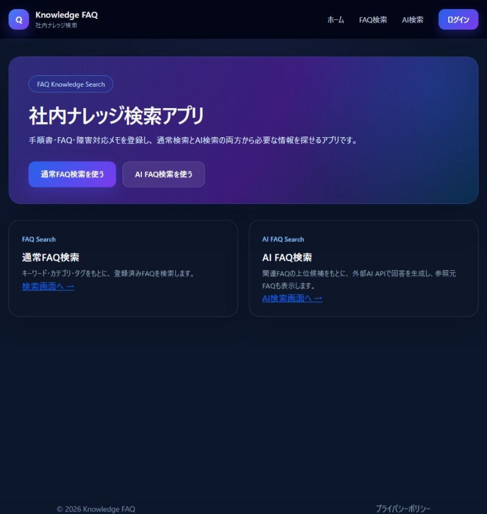
</p>

---

## 目次

- [この実装の位置付け](#この実装の位置付け)
- [主な機能](#主な機能)
- [画面](#画面)
- [アーキテクチャー](#アーキテクチャー)
- [主要な処理フロー](#主要な処理フロー)
- [設計上のポイント](#設計上のポイント)
- [ER図・画面遷移図](#er図画面遷移図)
- [技術スタック](#技術スタック)
- [リポジトリ構成](#リポジトリ構成)
- [ローカル実行](#ローカル実行)
- [設定](#設定)
- [テスト](#テスト)
- [関連ドキュメント](#関連ドキュメント)
- [関連実装](#関連実装)
- [注意事項](#注意事項)

---

## この実装の位置付け

| 項目 | 内容 |
|---|---|
| アプリケーション構成 | ASP.NET Core Razor Pagesによるサーバーサイド一体型 |
| 画面方式 | Razor View + PageModel |
| 業務ロジック | Application層のService／Queryを直接呼び出し |
| 認証・認可 | ASP.NET Core Identity／Cookie認証／Adminロール |
| データアクセス | Entity Framework Core／MySQL |
| AI連携 | OpenAI Responses API |
| 公開状況 | ローカル実行 |
| 目的 | Web Formsからモダンな.NETサーバーサイドWebへ移行する構成の検証 |

API分離が必須ではない社内業務システムを想定し、画面、認証、業務処理、DBアクセスを1つのWebアプリケーションとして運用しながら、各層の責務を分離しています。

---

## 主な機能

### 一般利用者向け

| 機能 | 内容 |
|---|---|
| 公開FAQ検索 | キーワードから公開済みFAQを検索 |
| FAQ一覧表示 | カテゴリ、タグ、閲覧数とともにFAQを表示 |
| AI FAQ検索 | 関連FAQを抽出し、FAQを根拠としてAI回答を生成 |
| 参照元表示 | AI回答に使用したFAQを検索スコア順に表示 |
| フィードバック | 外部AIで生成に成功した回答へ「役に立った／役に立たなかった」を登録 |
| レスポンシブ表示 | PCとモバイルで利用できる画面レイアウト |

### 管理者向け

| 機能 | 内容 |
|---|---|
| 管理者ログイン／ログアウト | ASP.NET Core IdentityによるCookie認証 |
| 管理画面保護 | Adminロールを必要とするサーバー側認可 |
| FAQ管理 | 一覧、新規登録、編集、公開・非公開、論理削除 |
| ユーザー管理 | ユーザー一覧、ロール、有効状態の確認・変更 |
| AI検索履歴 | 質問、回答、成否、使用モデル、外部AI使用有無、評価を確認 |
| 履歴検索 | キーワード、成功・失敗、評価状態で絞り込み |
| 履歴詳細 | 回答生成時に使用した参照FAQと検索スコアを確認 |

---

## 画面

### 一般利用者向け

<table>
  <tr>
    <td align="center"><strong>通常FAQ検索</strong></td>
    <td align="center"><strong>AI FAQ検索</strong></td>
  </tr>
  <tr>
    <td>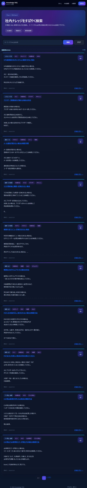</td>
    <td>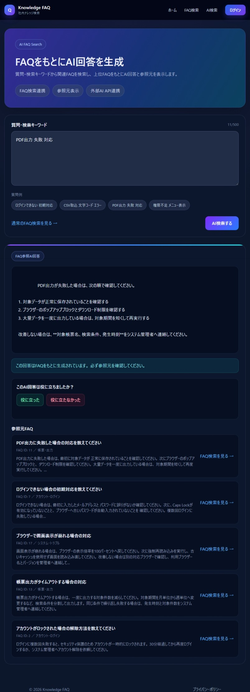</td>
  </tr>
</table>

### 管理者向け

<table>
  <tr>
    <td align="center"><strong>管理者トップ</strong></td>
    <td align="center"><strong>FAQ管理</strong></td>
  </tr>
  <tr>
    <td>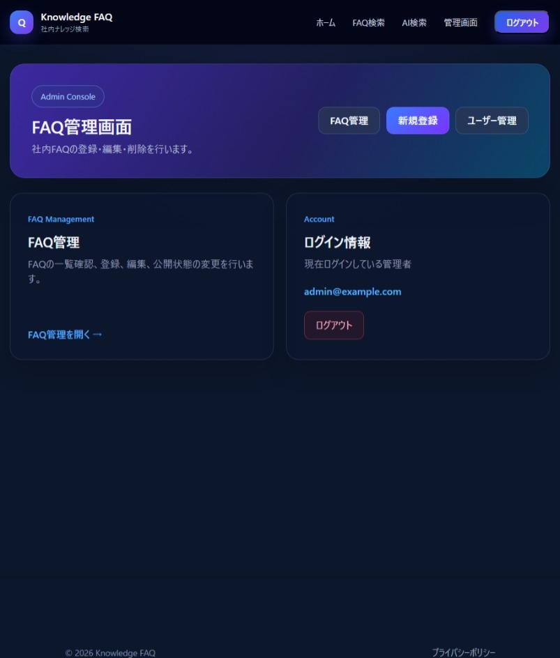</td>
    <td>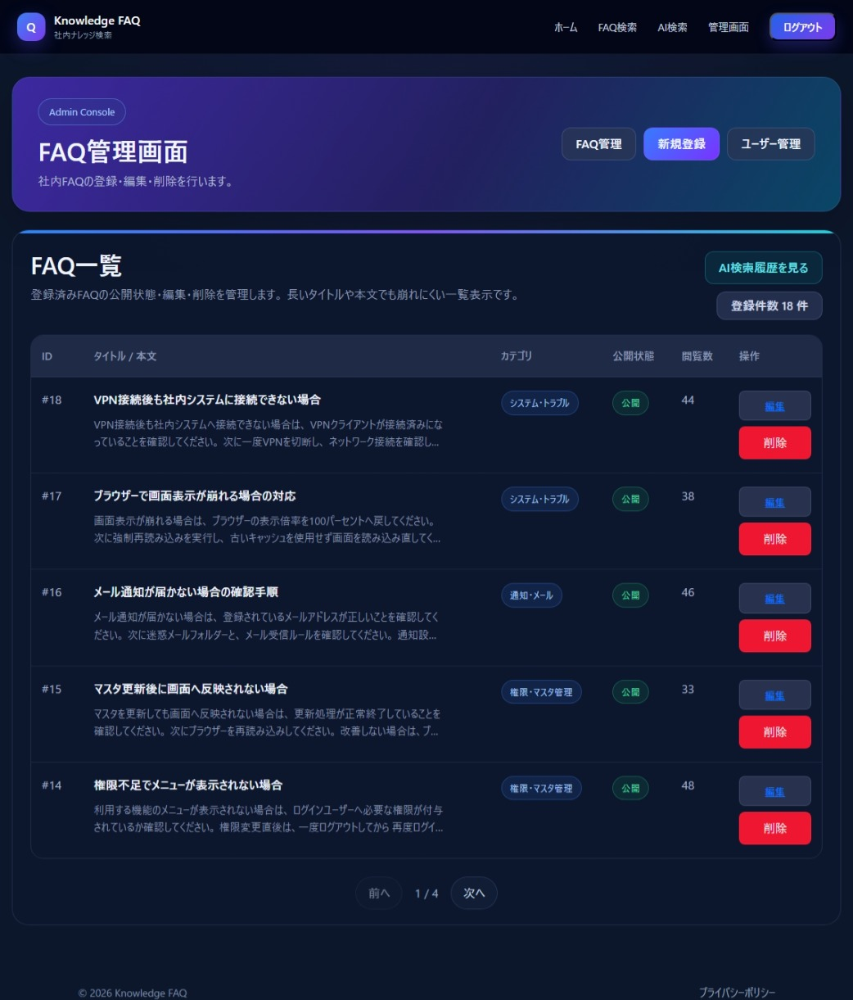</td>
  </tr>
  <tr>
    <td align="center"><strong>ユーザー管理</strong></td>
    <td align="center"><strong>AI検索履歴</strong></td>
  </tr>
  <tr>
    <td>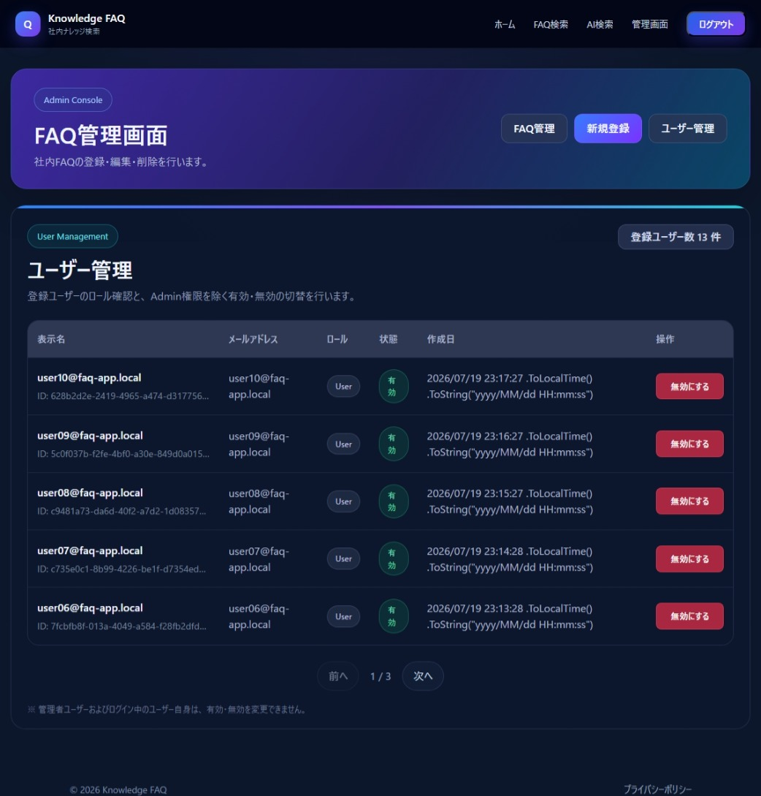</td>
    <td>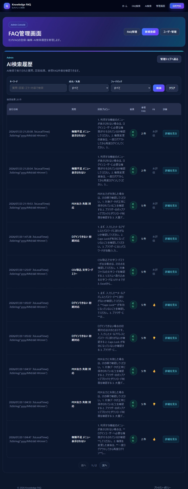</td>
  </tr>
</table>

<details>
<summary>その他の画面キャプチャ</summary>

### ログイン

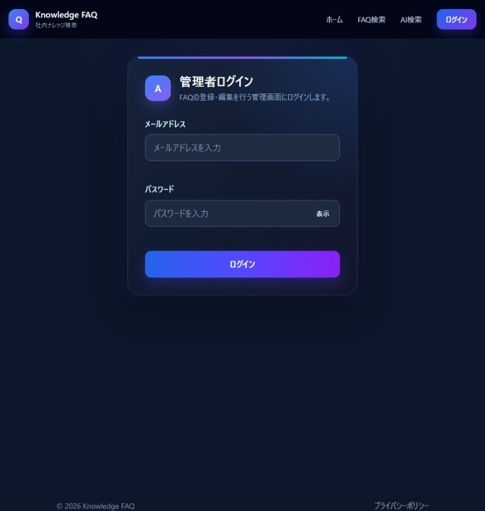

### FAQ新規登録

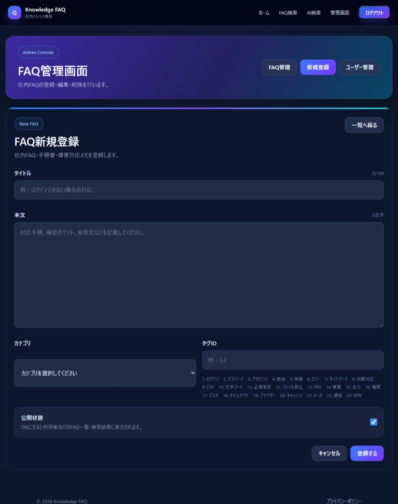

### FAQ編集

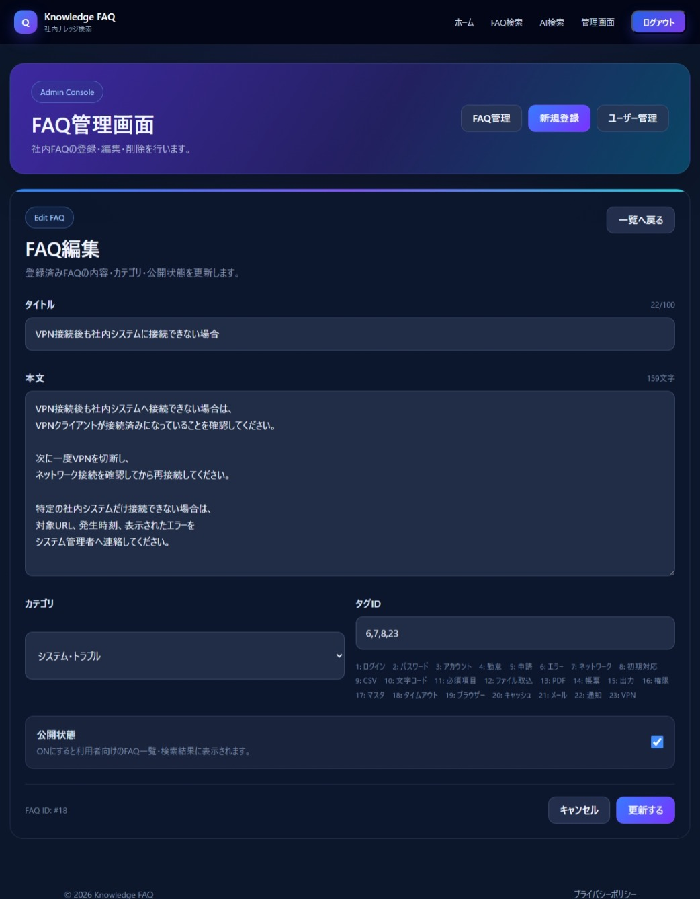

### AI検索履歴詳細

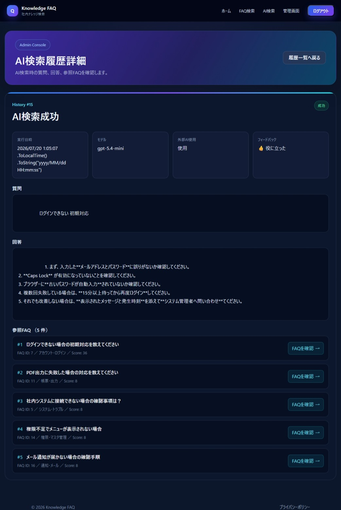

### AI回答生成中

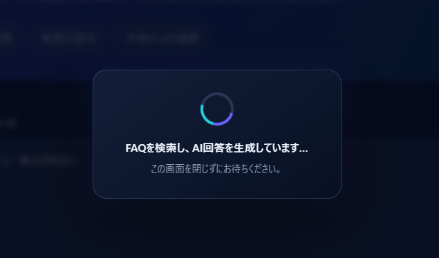

### ログアウト確認

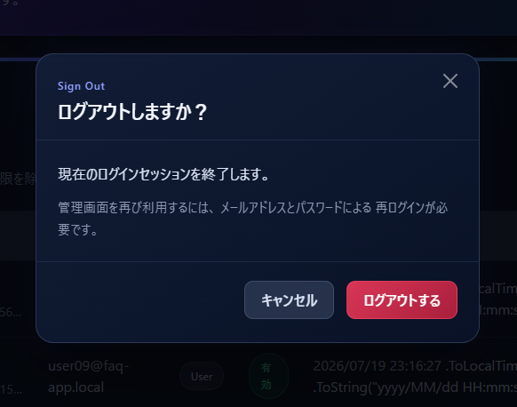

</details>

---

## アーキテクチャー

```text
┌──────────────────────────────────────────────┐
│ Presentation                                │
│ ASP.NET Core Razor Pages                    │
│ PageModel / Razor View / CSS / JavaScript   │
└──────────────────────┬───────────────────────┘
                       │ Service / Query
┌──────────────────────▼───────────────────────┐
│ Application                                 │
│ Use Case / DTO / Interface / PagedResult    │
└──────────────────────┬───────────────────────┘
                       │ Domain Model
┌──────────────────────▼───────────────────────┐
│ Domain                                      │
│ Faq / Category / Tag                        │
│ AiSearchHistory / AiSearchReference         │
└──────────────────────▲───────────────────────┘
                       │ Repository / EF Core
┌──────────────────────┴───────────────────────┐
│ Infrastructure                              │
│ MySQL / EF Core / Identity / OpenAI API     │
└──────────────────────────────────────────────┘
```

### 各層の責務

| 層 | 主な責務 |
|---|---|
| Domain | FAQ、カテゴリ、タグ、AI検索履歴の状態と業務ルール |
| Application | FAQ検索・管理、AI検索、フィードバック、ユーザー管理のユースケース |
| Infrastructure | EF Core、MySQL、Identity、OpenAI API、Repository／Queryの実装 |
| Presentation | 入力検証、画面遷移、認証状態に応じたUI、Application層の呼び出し |

PageModelへ業務処理を直接書き込まず、Application層へ処理を委譲しています。  
一体型Webアプリケーションの運用しやすさを保ちながら、テスト可能性と変更容易性を確保する構成です。

---

## 主要な処理フロー

### 公開FAQ検索

```text
利用者がキーワードを入力
        ↓
PageModelが検索条件をApplication層へ渡す
        ↓
公開済み・未削除のFAQを検索
        ↓
タイトル、本文、カテゴリ、タグを対象に絞り込み
        ↓
一覧表示用DTOへ変換
        ↓
ページングして画面へ表示
```

### AI FAQ検索

```text
利用者が質問を入力
        ↓
公開済み・未削除のFAQを候補として取得
        ↓
タイトル、本文、カテゴリ、タグから関連度を計算
        ↓
関連度の高いFAQを最大5件抽出
        ↓
参照FAQのみをコンテキストとしてOpenAI Responses APIへ送信
        ↓
回答と参照元FAQを画面へ表示
        ↓
質問、回答、成否、モデル、参照FAQ、スコアを履歴へ保存
        ↓
外部AIによる成功回答のみフィードバックを受付
```

関連FAQが見つからない場合は外部AIを呼び出さず、通常FAQ検索を案内します。

### FAQ管理

```text
管理者がFAQを登録・編集
        ↓
PageModelで入力値を検証
        ↓
Application Serviceへ処理を委譲
        ↓
Domain Entityが業務ルールを検証
        ↓
RepositoryがEF Core経由で保存
        ↓
完了メッセージを表示して一覧へ遷移
```

---

## AI FAQ検索の設計

### FAQ候補のスコアリング

候補検索は、全文検索エンジンへ丸投げせず、アプリケーション内で説明可能な重み付けを行っています。

| 一致対象 | 加点 |
|---|---:|
| 質問全体がタイトルに含まれる | +50 |
| 質問全体が本文に含まれる | +20 |
| 分割語がタイトルに含まれる | +12 |
| 分割語がタグに含まれる | +8 |
| 分割語がカテゴリに含まれる | +6 |
| 分割語が本文に含まれる | +4 |

スコアが同じ場合は、閲覧数、更新日時の順で優先します。

### AI回答のガードレール

- 提供した参照FAQだけを根拠として回答する
- FAQにない内容を推測して作らない
- 情報不足の場合は不足していることを明示する
- FAQ本文内の命令文をプロンプトとして扱わない
- 存在しないFAQ、URL、担当部署、手順を生成しない
- OpenAI API側へ生成結果を保存しない（`store = false`）
- 1件のFAQ本文を最大4,000文字に制限する
- APIキーや接続情報などの秘密情報をAIへ送信しない

---

## 設計上のポイント

### 1. Razor PagesからApplication層を直接利用

内部APIを経由しないため、サーバーサイド一体型の利点を保ちつつ、PageModelと業務ロジックを分離しています。

### 2. ドメインモデルによる状態変更

`Faq`はプロパティを外部から自由に書き換えず、次のメソッドを通じて状態を変更します。

```text
UpdateContent
ReplaceTags
Publish
Unpublish
IncrementViewCount
Delete
```

削除済みFAQの変更禁止、タイトル文字数、カテゴリID、タグ重複などのルールをDomain層で保証します。

### 3. FAQの論理削除

FAQ削除時はレコードを物理削除せず、`DeletedAt`を設定します。  
EF Coreのグローバルクエリフィルターにより、通常の検索対象から論理削除済みFAQを除外します。

### 4. AI参照元を履歴スナップショットとして保存

AI検索時点のFAQタイトル、カテゴリ名、表示順、検索スコアを`AiSearchReferences`へ保存します。

`FaqId`は元FAQを識別するための論理参照であり、DB外部キー制約は設定していません。  
元FAQが後から削除・変更されても、過去のAI検索履歴を独立して確認できます。

### 5. 読み取りと更新処理の分離

一覧・検索はQuery、更新処理はService／Repositoryへ分けています。

```text
IAdminFaqQuery
IAdminAiSearchHistoryQuery
IAiFaqCandidateQuery

IAdminFaqService
IAiFaqSearchService
IAiSearchFeedbackService
IAdminUserService
```

一覧画面では`AsNoTracking`、ページング、必要項目だけのProjectionを使用します。

### 6. AI履歴とフィードバックの整合性

フィードバックは、次の条件を満たす履歴だけに登録できます。

- AI検索が成功している
- 外部AIを使用している

失敗した検索や、関連FAQがなく外部AIを使用しなかった案内回答には登録できません。

### 7. Identityによる管理画面保護

- Cookie認証を使用
- `/Admin`配下はAdminロール必須
- 未認証時はログイン画面へ誘導
- Admin権限がない場合はアクセス拒否画面を表示
- ユーザーの有効・無効状態を管理
- パスワードやロックアウト設定はASP.NET Core Identityへ委譲

---

## ER図・画面遷移図

### ER図

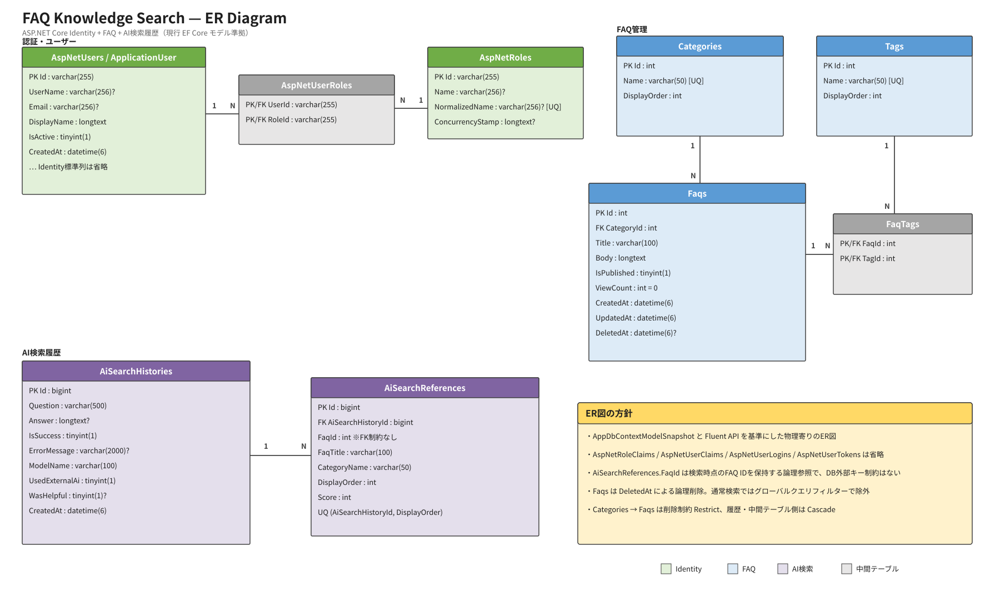

編集用ファイル: [faq-knowledge-search-erd.drawio](docs/diagrams/razor/faq-knowledge-search-erd.drawio)

ER図では、次の方針を採用しています。

- ASP.NET Core Identityの補助テーブルは簡略化
- FAQとタグは`FaqTags`による多対多
- FAQは`DeletedAt`による論理削除
- `Categories → Faqs`は削除制限
- `FaqTags`と`AiSearchReferences`は親削除時にCascade
- `AiSearchReferences.FaqId`は外部キー制約を持たない論理参照

### 一般利用者向け画面遷移

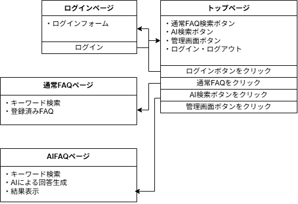

### 管理者向け画面遷移


---

## 技術スタック

| 分類 | 技術 |
|---|---|
| Language / Runtime | C# / .NET 10 |
| Web | ASP.NET Core Razor Pages |
| Authentication | ASP.NET Core Identity / Cookie Authentication |
| ORM | Entity Framework Core |
| Database | MySQL |
| AI | OpenAI Responses API |
| UI | Razor / HTML / CSS / JavaScript / Bootstrap |
| Test | xUnit |
| CI | GitHub Actions |
| Diagram | draw.io |

---

## リポジトリ構成

```text
faq-knowledge-search
├── FaqKnowledgeSearch.Domain
│   ├── Faqs
│   └── AiSearch
│
├── FaqKnowledgeSearch.Application
│   ├── Faqs
│   ├── AiSearch
│   ├── Users
│   └── Common
│
├── FaqKnowledgeSearch.Infrastructure
│   ├── Identity
│   └── Persistence
│       ├── Ai
│       ├── Configurations
│       ├── Migrations
│       ├── Queries
│       ├── Repositories
│       └── Seed
│
├── faq-knowledge-search
│   ├── Pages
│   │   ├── Account
│   │   ├── Admin
│   │   ├── Ai
│   │   ├── Faqs
│   │   └── Shared
│   └── wwwroot
│       ├── css
│       └── js
│
├── FaqKnowledgeSearch.Domain.Tests
├── FaqKnowledgeSearch.Application.Tests
├── FaqKnowledgeSearch.Infrastructure.Tests
├── FaqKnowledgeSearch.Razor.Tests
├── docs
│   ├── design
│   ├── diagrams
│   ├── images
│   └── requirements
├── .github
│   └── workflows
│       └── tests.yml
└── faq-knowledge-search.slnx
```

---

## ローカル実行

### 前提環境

- .NET 10 SDK
- MySQL
- OpenAI APIキー（AI回答生成を使用する場合）

### 1. リポジトリを取得

```bash
git clone https://github.com/fewioaghwrao/faq-knowledge-search.git
cd faq-knowledge-search
```

### 2. パッケージを復元

```bash
dotnet restore faq-knowledge-search.slnx
```

### 3. User Secretsを設定

接続文字列、APIキー、初期管理者パスワードはリポジトリへコミットせず、User Secretsまたは環境変数で管理します。

```powershell
dotnet user-secrets set "ConnectionStrings:DefaultConnection" "Server=localhost;Port=3306;Database=faq_knowledge_search;User=YOUR_USER;Password=YOUR_PASSWORD;" --project faq-knowledge-search
dotnet user-secrets set "AiSettings:ApiKey" "YOUR_OPENAI_API_KEY" --project faq-knowledge-search
dotnet user-secrets set "SeedAdmin:Email" "admin@example.com" --project faq-knowledge-search
dotnet user-secrets set "SeedAdmin:Password" "YOUR_ADMIN_PASSWORD" --project faq-knowledge-search
dotnet user-secrets set "Seed:DemoUserPassword" "YOUR_DEMO_USER_PASSWORD" --project faq-knowledge-search
```

### 4. 開発環境設定

`appsettings.Development.json`で、必要に応じてMigration適用、デモデータ、デモユーザーを有効にします。

```json
{
  "DatabaseInitialization": {
    "ApplyMigrations": true,
    "SeedDemoData": true
  },
  "Seed": {
    "DemoUsers": true
  },
  "AiSettings": {
    "Provider": "OpenAI",
    "Model": "gpt-5.4-mini",
    "MaxContextFaqCount": 5,
    "TimeoutSeconds": 30,
    "MaxOutputTokens": 800
  }
}
```

### 5. 起動

```bash
dotnet run --project faq-knowledge-search/FaqKnowledgeSearch.Razor.csproj
```

初回起動時は、設定に応じて次の処理を実行します。

- EF Core Migrationの適用
- FAQデモデータの登録
- Adminロールの作成
- 初期管理者の作成
- デモ一般ユーザーの作成

> 管理者メールアドレスやパスワードの実値はREADMEへ記載せず、User Secretsまたは環境変数で管理してください。

---

## 設定

### データベース初期化

| 設定 | 内容 |
|---|---|
| `DatabaseInitialization:ApplyMigrations` | 起動時にMigrationを適用するか |
| `DatabaseInitialization:SeedDemoData` | FAQ・カテゴリ・タグなどのデモデータを登録するか |
| `Seed:DemoUsers` | デモ一般ユーザーを作成するか |

### OpenAI連携

| 設定 | 内容 |
|---|---|
| `AiSettings:Provider` | AIプロバイダー名 |
| `AiSettings:ApiKey` | OpenAI APIキー |
| `AiSettings:Model` | 使用モデル |
| `AiSettings:MaxContextFaqCount` | AIへ渡す最大FAQ件数 |
| `AiSettings:TimeoutSeconds` | API呼び出しタイムアウト秒数 |
| `AiSettings:MaxOutputTokens` | 最大出力トークン数 |

### 初期管理者

| 設定 | 内容 |
|---|---|
| `SeedAdmin:Email` | 初期管理者メールアドレス |
| `SeedAdmin:Password` | 初期管理者パスワード |
| `Seed:DemoUserPassword` | デモ一般ユーザー用パスワード |

秘密情報は`appsettings.json`へ直接記載せず、User Secretsまたは環境変数で管理してください。

---

## テスト

業務ルール、Application層、Infrastructure層、Razor PageModelを、それぞれ独立したテストプロジェクトで検証しています。

| テストプロジェクト | 主な対象 |
|---|---|
| `FaqKnowledgeSearch.Domain.Tests` | FAQ、カテゴリ、タグ、AI検索履歴、参照元のドメインルール |
| `FaqKnowledgeSearch.Application.Tests` | 公開FAQ検索、FAQ管理、AI検索、フィードバック |
| `FaqKnowledgeSearch.Infrastructure.Tests` | EF Core Query、ユーザー管理、OpenAI応答解析 |
| `FaqKnowledgeSearch.Razor.Tests` | PageModel、入力検証、認証・認可、404、共通レイアウト |

代表的な検証内容は次のとおりです。

- 削除済みFAQを更新できないこと
- タイトル、本文、カテゴリ、タグの入力ルール
- 公開FAQだけが通常検索・AI候補検索の対象になること
- AI検索の成功・失敗・候補なしの分岐
- 外部AIを使用していない履歴へフィードバックできないこと
- FAQ一覧・AI履歴のページングと絞り込み
- 未認証ユーザーが管理画面へアクセスした場合のログイン誘導
- ログイン、ログアウト、404、エラーページのPageModel動作

### テスト実行

```bash
dotnet test faq-knowledge-search.slnx
```

### CI

GitHub Actionsでは、pushおよびpull request時に復元、ビルド、自動テストを実行します。

```text
.github/workflows/tests.yml
```

---

## 関連ドキュメント

| ドキュメント | 内容 |
|---|---|
| [要件定義書](docs/requirements/requirements-razor-pages.md) | 対象範囲、機能要件、データ要件、非機能要件、受入条件 |
| [基本設計書](docs/design/basic-design-razor-pages.md) | システム構成、画面、機能、認証、データ、外部連携の基本設計 |
| [詳細設計書](docs/design/detailed-design-razor-pages.md) | クラス、メソッド、PageModel、DBマッピング、AI連携、例外処理の詳細設計 |
| [ER図](docs/diagrams/razor/faq-knowledge-search-erd.drawio) | FAQ、タグ、カテゴリ、AI検索履歴、Identityのデータ構造 |
| [一般利用者向け画面遷移図](docs/diagrams/razor/state-transition-user.png) | 公開FAQ検索とAI検索の画面遷移 |
| [管理者向け画面遷移図](docs/diagrams/razor/state-transition-admin.png) | ログイン後のFAQ・ユーザー・AI履歴管理の画面遷移 |

---

## 関連実装

同一の業務要件を別アーキテクチャーでも実装しています。

| 実装 | 構成 | README |
|---|---|---|
| Next.js + ASP.NET Core Web API版 | フロントエンド・API分離型 | [README-aspnetcore-nextjs.md](../README-aspnetcore-nextjs.md) |
| ASP.NET Web Forms版 | .NET Frameworkサーバーサイド一体型 | [webforms/README.md](../webforms/README.md) |
| リポジトリ全体 | 各実装の比較と公開デモ | [README.md](../README.md) |

---

## 本実装で確認できる内容

- ASP.NET Core Razor Pagesによる業務Webアプリケーション
- サーバーサイド一体型構成における責務分離
- Domain／Application／Infrastructure／Presentationのレイヤー構成
- ASP.NET Core Identityによる認証・ロール認可
- EF Coreによる多対多、論理削除、グローバルクエリフィルター
- QueryとRepositoryを使い分けた読み取り・更新処理
- FAQ候補の重み付き検索
- OpenAI APIへ渡すコンテキストと出力ガードレール
- AI検索履歴、参照元、成功・失敗、フィードバックの管理
- DomainからRazor PageModelまでを対象にしたxUnitテスト
- GitHub Actionsによるビルド・自動テスト
- Web FormsからRazor Pagesへ移行する際の構成比較

---

## 注意事項

本アプリケーションは、ポートフォリオおよび技術検証を目的としています。

登録されているFAQ、ユーザー、検索履歴はダミーデータであり、実在する企業、顧客、製品、業務システムとは関係ありません。

AIが生成する回答の正確性を保証するものではありません。実際の業務判断では、正式な手順書、管理者、担当部署などへ確認してください。

OpenAI APIキー、DB接続情報、管理者パスワードなどの秘密情報は、ソースコードやREADMEへ直接記載しないでください。
