# FAQ Knowledge Search - ASP.NET Web Forms

[](https://github.com/fewioaghwrao/faq-knowledge-search/actions/workflows/webforms-unit-tests.yml)

社内FAQや業務ナレッジを一元管理し、通常検索とAI検索から必要な情報を確認できる、ASP.NET Web Forms製のWebアプリケーションです。

一般利用者向けのFAQ検索・AI検索機能と、管理者向けのFAQ管理・AI検索履歴管理・ユーザー管理機能を実装しています。

本プロジェクトは、同一の業務要件を別アーキテクチャーで実装した比較用ポートフォリオの一つです。

- ASP.NET Web Formsによる一体型Webアプリケーション
- Next.js + ASP.NET Core Web APIによるフロントエンド・バックエンド分離型アプリケーション

---

## 関連ドキュメント

本プロジェクトの要件、基本設計、内部処理の詳細は、以下のドキュメントにまとめています。

| ドキュメント | 内容 |
|---|---|
| [要件定義書](docs/requirements/requirements-webforms.md) | 背景、目的、対象範囲、機能要件、非機能要件 |
| [基本設計書](docs/design/basic-design-webforms.md) | システム構成、画面、機能、認証、データベースの基本設計 |
| [詳細設計書](docs/design/detail-design-webforms.md) | クラス、画面イベント、Service、DTO、AI連携、例外処理の詳細設計 |

設計図は、READMEおよび各設計書から参照しています。

| 設計図 | 内容 |
|---|---|
| [一般利用者向け画面遷移図](docs/images/webforms/screen-transition-user.drawio.png) | 一般利用者向け画面の遷移 |
| [管理者向け画面遷移図](docs/images/webforms/screen-transition-admin.drawio.png) | 管理画面の遷移 |
| [ER図](docs/images/webforms/ERD.drawio.png) | FAQ、AI検索履歴、Identity関連テーブルの構成 |

---

## プロジェクト概要

社内業務では、操作手順、障害対応方法、エラーへの対処方法などが、担当者の経験、個別メモ、チャット履歴、手順書などに分散しやすくなります。

その結果、次のような問題が発生します。

- 必要な情報を見つけるまでに時間がかかる
- 特定の担当者に問い合わせが集中する
- 同じ問い合わせが繰り返される
- 新人教育や引き継ぎで過去の対応を確認しづらい
- AI回答が何を根拠に生成されたのか分かりにくい

本アプリでは、社内業務に関するFAQをデータベースで一元管理し、キーワード検索とAI FAQ検索の両方から情報を確認できるようにしています。

AI検索では、登録済みFAQから関連する情報を検索し、そのFAQをコンテキストとしてOpenAI APIへ渡します。生成された回答とあわせて参照元FAQを表示することで、回答の根拠を確認できる構成にしています。

---

## 主な特徴

### ASP.NET Web Formsによる一体型構成

画面表示、イベント処理、業務処理、データベースアクセスを、ASP.NET Web Formsを中心とした一体型アプリケーションとして構築しています。

CodeBehindへすべての処理を直接記述するのではなく、Service、DTO、Entity、DbContextへ責務を分離しています。

```text
ASPX
  ↓
CodeBehind
  ↓
Service
  ↓
DTO / Entity
  ↓
Entity Framework 6
  ↓
MySQL
```

### 通常検索とAI検索の併用

用途に応じて、次の2種類の検索方法を利用できます。

- キーワードによる通常FAQ検索
- 自然文によるAI FAQ検索

AI検索だけに依存せず、利用者が参照元FAQの詳細を直接確認できるようにしています。

### 管理者向け機能

管理者は、FAQの登録・編集・公開状態の変更・論理削除を行えます。

また、AI検索履歴やフィードバックを確認し、利用者がどのような情報を求めているかを把握できます。

### 認証・認可

管理者向け画面には、ASP.NET Identity 2とOWIN Cookie認証を使用しています。

未認証ユーザーが管理画面へアクセスした場合は、ログイン画面へリダイレクトします。

認証済みであっても管理者権限を持たないユーザーがアクセスした場合は、HTTP 403としてアクセスを拒否します。
---

## 実装機能

### 一般利用者向け機能

| 機能 | 内容 |
| --- | --- |
| トップ画面 | アプリケーション概要と主要機能への導線を表示 |
| FAQ一覧 | 公開中のFAQを一覧表示 |
| FAQキーワード検索 | タイトル、本文、カテゴリ、タグからFAQを検索 |
| FAQ詳細 | FAQ本文、カテゴリ、タグ、閲覧数などを表示 |
| AI FAQ検索 | 自然文の質問から関連FAQを検索し、AI回答を生成 |
| 参照元FAQ表示 | AI回答の生成に使用したFAQを表示 |
| AI回答フィードバック | 回答が役に立ったかどうかを記録 |

### 管理者向け機能

| 機能 | 内容 |
| --- | --- |
| 管理者ログイン | メールアドレスとパスワードによる認証 |
| 管理トップ | 管理者向け機能への導線を表示 |
| FAQ一覧 | 公開・非公開を含むFAQを検索・一覧表示 |
| FAQ新規登録 | タイトル、本文、カテゴリ、タグなどを登録 |
| FAQ編集 | 登録済みFAQの内容を更新 |
| 公開・非公開管理 | FAQごとに一般利用者への公開状態を設定 |
| FAQ論理削除 | データを物理削除せず削除状態として管理 |
| AI検索履歴一覧 | AI検索の質問、回答、成否、実行日時などを表示 |
| AI検索履歴詳細 | 質問、AI回答、参照元FAQ、フィードバックを表示 |
| ユーザー一覧 | 登録ユーザーの情報と状態を一覧表示 |
| ユーザー有効・無効管理 | ユーザーのログイン可否を管理 |
| ログアウト | 確認ダイアログを表示してログアウト |

---

## 画面構成

### トップ画面

通常FAQ検索、AI FAQ検索、管理画面への主要な導線を表示します。

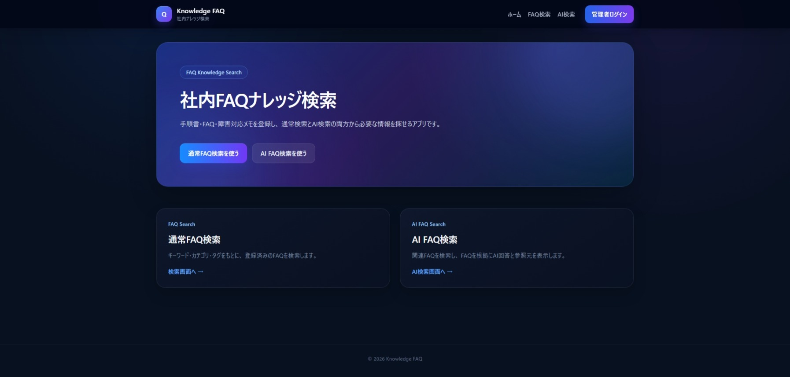

### 通常FAQ検索画面

キーワードを入力し、登録済みの公開FAQを検索します。

検索結果には、FAQタイトル、本文の一部、カテゴリ、タグ、閲覧数などを表示します。

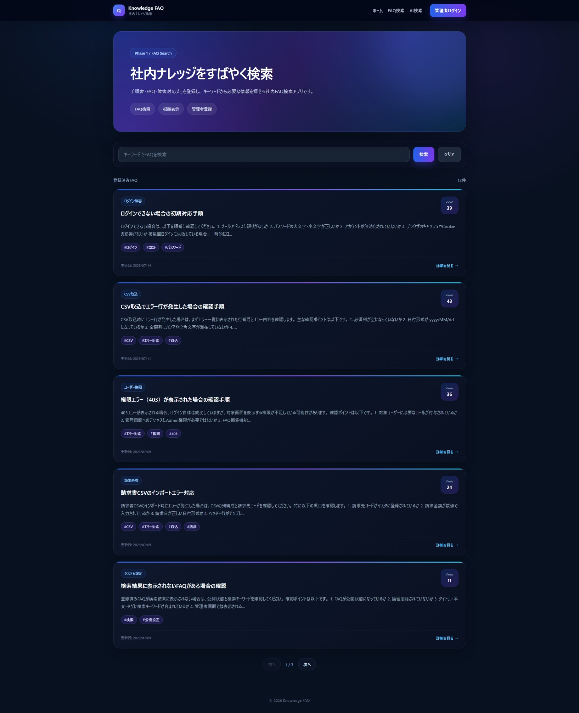

### FAQ詳細画面

選択したFAQの本文、カテゴリ、タグ、閲覧数、更新日時などを表示します。

一般利用者には、公開状態のFAQのみ表示します。

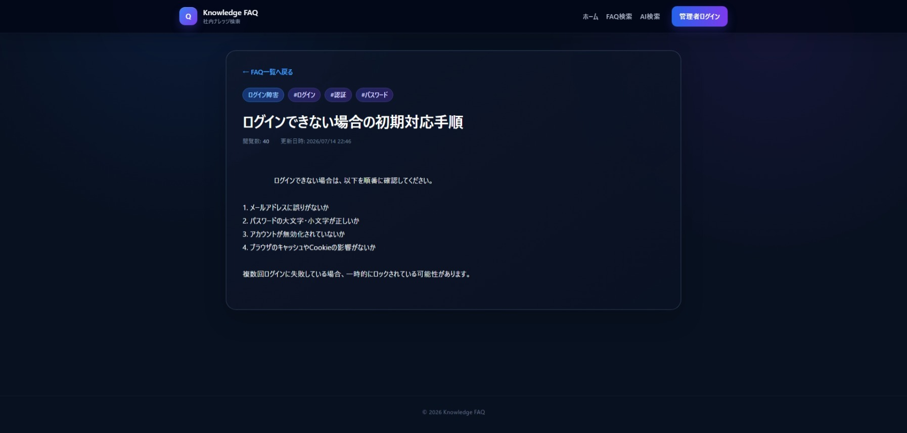

### AI FAQ検索画面

利用者が入力した自然文の質問をもとに関連FAQを検索し、OpenAI APIを利用して回答を生成します。

回答画面には、AI回答だけでなく、回答の生成に使用した参照元FAQも表示します。

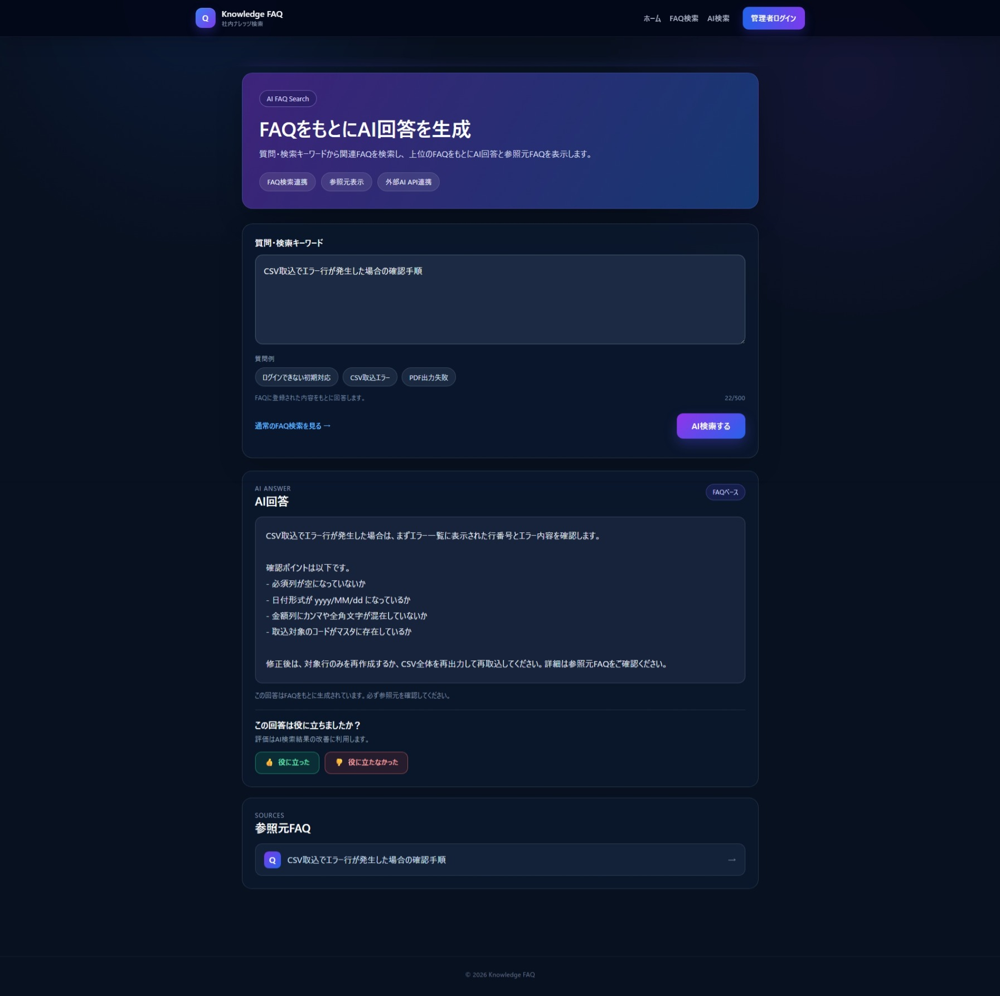

### 管理者ログイン画面

管理者向け機能へアクセスするためのログイン画面です。

認証成功後は管理トップ画面へ遷移します。

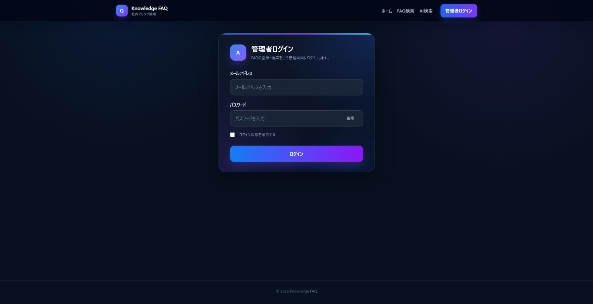

### 管理トップ画面

FAQ管理、AI検索履歴、ユーザー管理への導線を表示します。

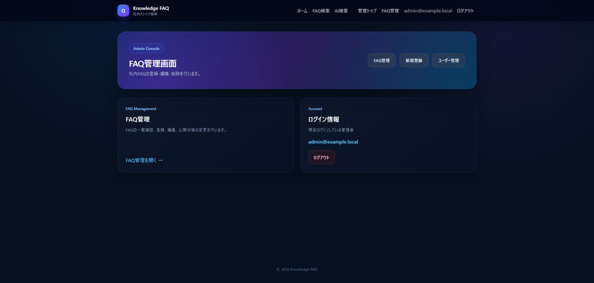

### FAQ管理画面

FAQの検索、一覧表示、新規登録、編集、公開状態の設定、論理削除を行います。

#### FAQ一覧

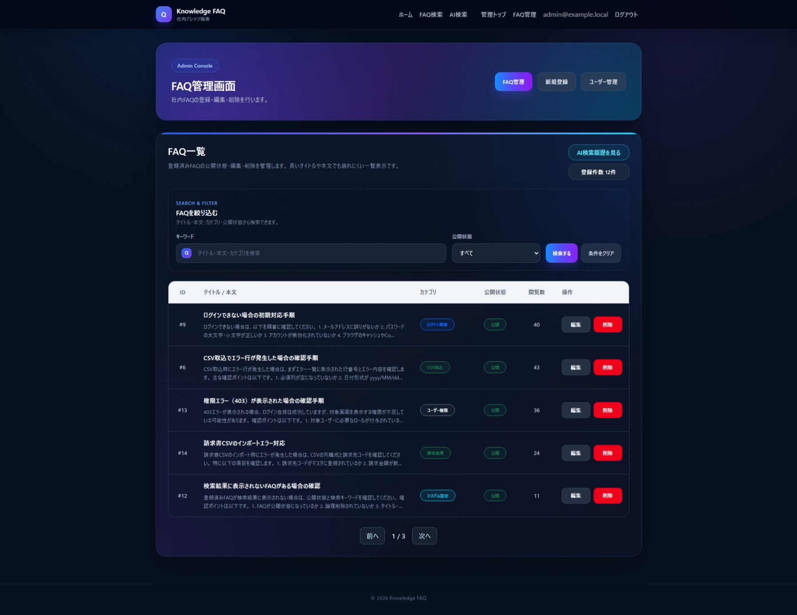

#### FAQ新規登録

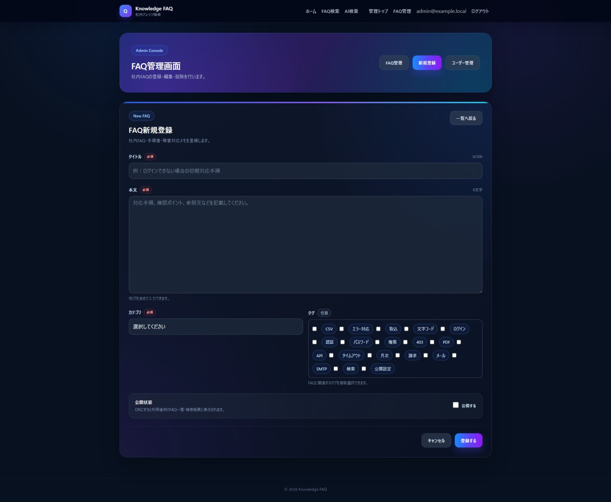

#### FAQ編集

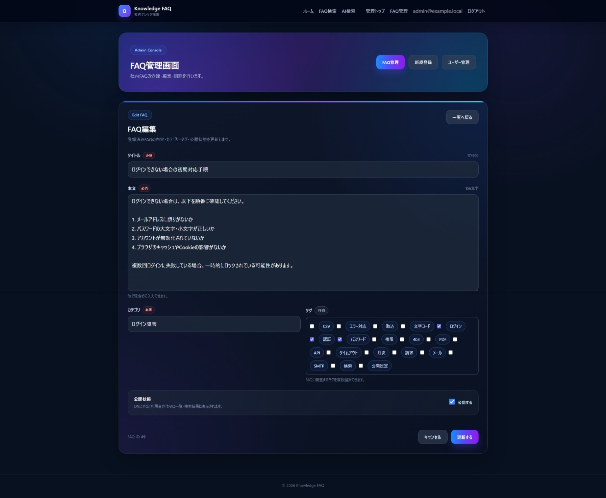

### AI検索履歴画面

利用者が実行したAI検索の質問、回答、参照元FAQ、成否、実行日時、フィードバックを確認します。

#### AI検索履歴一覧

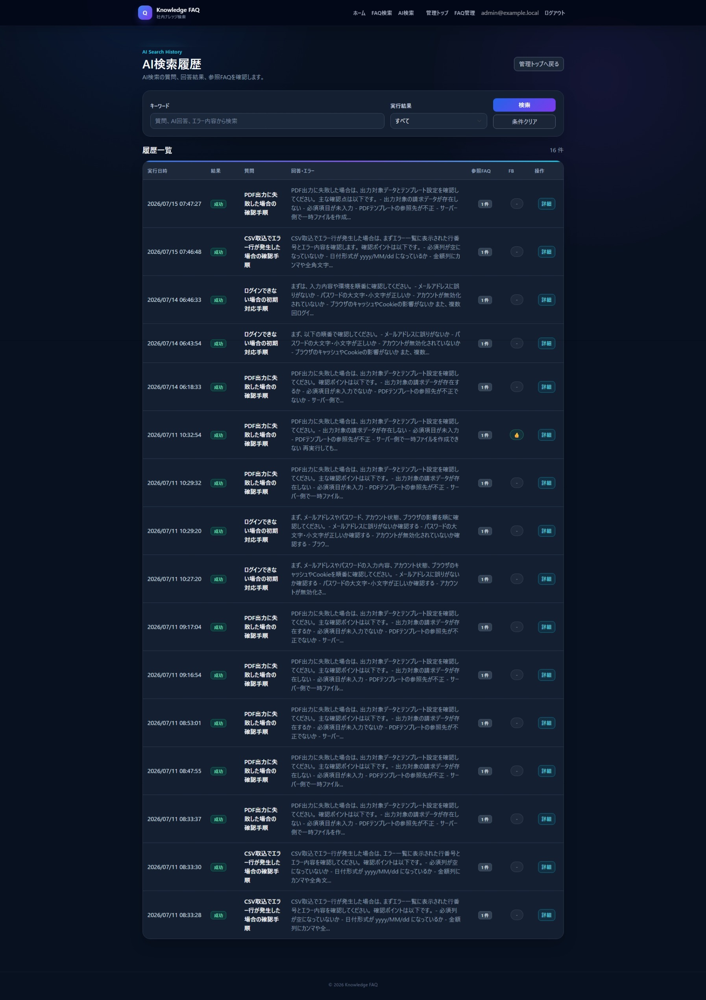

#### AI検索履歴詳細

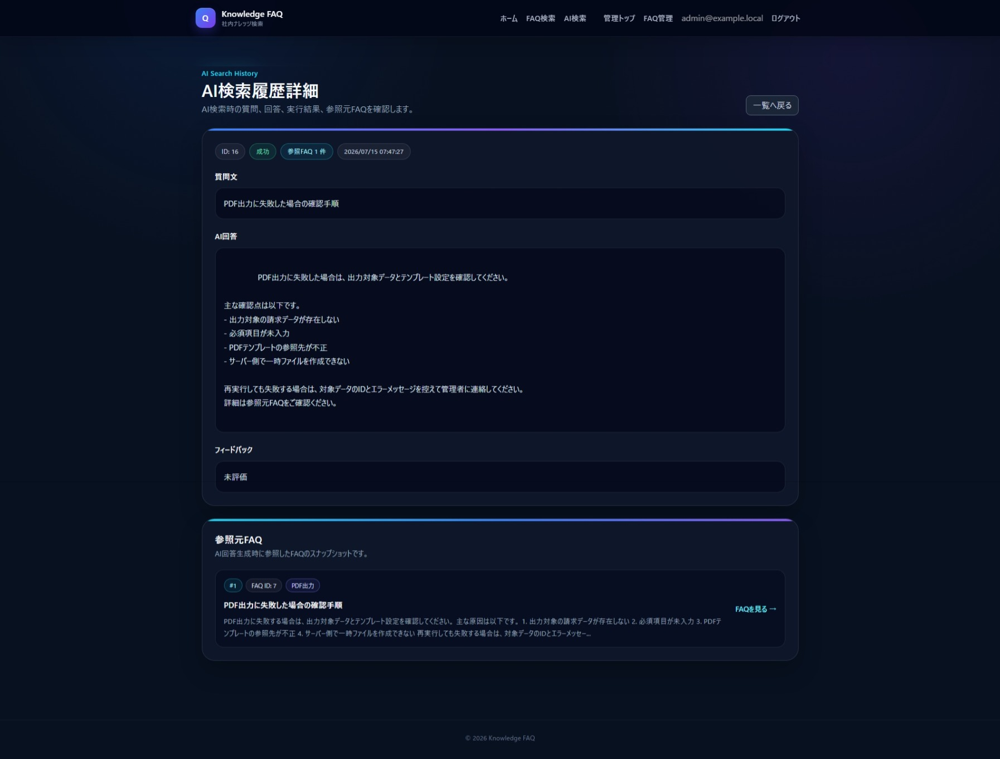

### ユーザー管理画面

ASP.NET Identityに登録されたユーザーを一覧表示し、有効・無効状態を管理します。

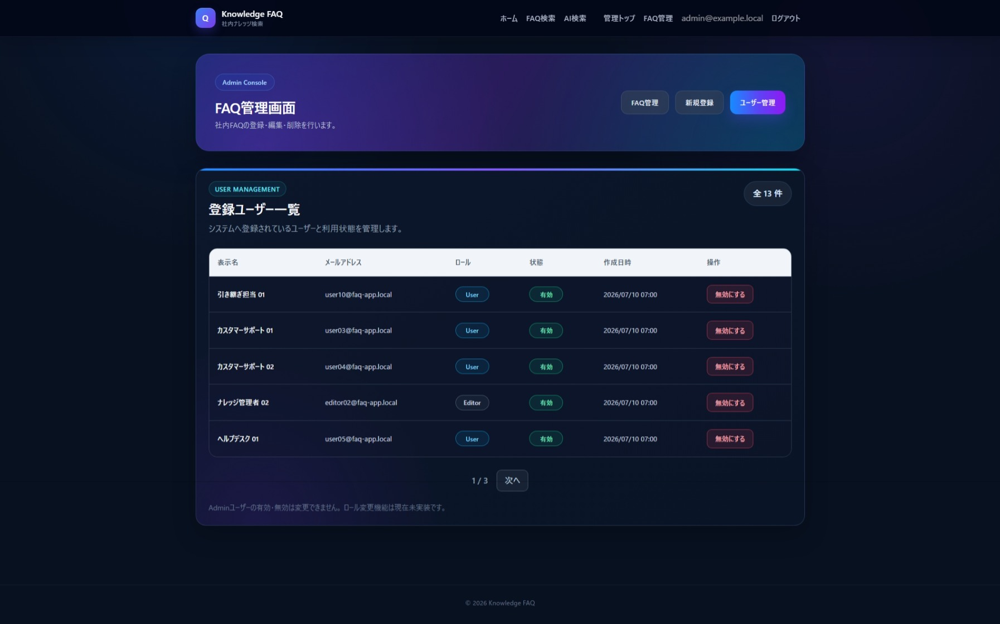

---

## 画面遷移図

一般利用者向け画面と管理者向け画面の主な遷移を示します。

### 一般利用者向け画面遷移

一般利用者はトップ画面から、通常FAQ検索、FAQ詳細、AI FAQ検索を利用できます。

管理画面へアクセスした場合は、管理者ログイン画面へ遷移します。


### 管理者向け画面遷移

管理者はログイン後、管理トップ画面からFAQ管理、AI検索履歴、ユーザー管理へ移動できます。

FAQ管理では、FAQ一覧から新規登録画面および編集画面へ遷移します。


---

## AI FAQ検索

### 処理の流れ

```text
利用者が質問を入力
        ↓
関連する公開FAQを検索
        ↓
上位FAQをコンテキストとして整形
        ↓
OpenAI APIへリクエスト
        ↓
FAQに基づく回答を生成
        ↓
回答と参照元FAQを保存
        ↓
画面へ回答と参照元を表示
        ↓
利用者のフィードバックを保存
```

### AI回答の方針

AI回答では、次の方針を設定しています。

- 検索されたFAQを根拠として回答する
- FAQに記載されていない内容を断定しない
- 手順、原因、担当部署、問い合わせ先などを推測で補完しない
- 認証情報や個人情報などの機密情報を回答へ含めない
- 回答とあわせて参照元FAQを表示する
- 最終的な判断では参照元FAQの確認を促す

---

## 認証・認可

管理者向け画面には、ASP.NET Identity 2とOWIN Cookie認証を使用しています。

```text
管理画面へアクセス
        ↓
ログイン状態と権限を確認
        ↓
未認証または権限不足
        ├── ログイン画面へリダイレクト
        ↓
管理者権限あり
        └── 管理画面を表示
```

管理画面共通の認可処理は、管理画面用の基底ページへ集約しています。

### 権限

| 利用者 | 利用可能な機能 |
| --- | --- |
| 未認証ユーザー | 公開FAQ検索、FAQ詳細、AI FAQ検索 |
| 一般ユーザー | 一般利用者向け機能 |
| 管理者ユーザー | FAQ管理、AI検索履歴確認、ユーザー管理 |

### 認証・認可のE2Eテスト

ブラウザ操作によるE2Eテストとして、次の動作を確認しています。

| テスト内容 | 期待結果 |
| --- | --- |
| 管理者権限を持たないユーザーが管理画面へアクセス | 管理者ログイン画面へリダイレクトされる |
| 管理者ユーザーでログインして管理画面へアクセス | 管理トップ画面が正常に表示される |

テストで使用するユーザー名、メールアドレス、パスワードなどの認証情報は、READMEおよびリポジトリには掲載していません。

---

## アーキテクチャ

```text
┌───────────────────────────────┐
│ User Browser                  │
└───────────────┬───────────────┘
                │ HTTP / PostBack
                ▼
┌───────────────────────────────┐
│ ASP.NET Web Forms             │
│ .NET Framework 4.8            │
│                               │
│ ・ASPX                        │
│ ・CodeBehind                  │
│ ・Master Page                 │
│ ・UserControl                 │
│ ・ASP.NET Identity 2          │
│ ・OWIN Cookie Authentication  │
└───────────────┬───────────────┘
                │
                ▼
┌───────────────────────────────┐
│ Application Layer             │
│                               │
│ ・FAQ Service                 │
│ ・AI Search Service           │
│ ・AI Search History Service   │
│ ・AI Feedback Service         │
│ ・User Management Service     │
│ ・DTO                         │
└───────────────┬───────────────┘
                │
                ▼
┌───────────────────────────────┐
│ Entity Framework 6             │
│ DbContext / Entity            │
└───────────────┬───────────────┘
                │
                ▼
┌───────────────────────────────┐
│ MySQL                         │
└───────────────────────────────┘
```

AI検索時：

```text
┌───────────────────────────────┐
│ AI Search Service             │
└───────────────┬───────────────┘
                │ HTTPS
                ▼
┌───────────────────────────────┐
│ OpenAI API                    │
└───────────────────────────────┘
```

---

## データベース構成

主なテーブルは次のとおりです。

| テーブル | 内容 |
|---|---|
| `categories` | FAQカテゴリ |
| `faqs` | FAQ本文、公開状態、閲覧数、論理削除状態など |
| `tags` | FAQに付与するタグ |
| `faq_tags` | FAQとタグの多対多を管理する中間テーブル |
| `ai_search_histories` | AI検索の質問、回答、成否、実行日時など |
| `ai_search_history_sources` | AI回答生成時に使用した参照元FAQ |
| `ai_search_feedbacks` | AI回答に対するフィードバック |
| `AspNetUsers` | ASP.NET Identityユーザー |
| `AspNetRoles` | ASP.NET Identityロール |
| `AspNetUserRoles` | ユーザーとロールの関連 |

### ER図

FAQ、カテゴリ、タグ、AI検索履歴、参照元FAQ、フィードバック、ASP.NET Identityユーザーの関連を示します。


### 主な関連

```text
categories 1 ─── N faqs

faqs N ─── N tags
       faq_tags

ai_search_histories 1 ─── N ai_search_history_sources

faqs 1 ─── N ai_search_history_sources

ai_search_histories 1 ─── 0..1 ai_search_feedbacks

AspNetUsers N ─── N AspNetRoles
             AspNetUserRoles
```

---

## 使用技術

| 区分 | 技術 |
| --- | --- |
| 言語 | C# |
| Webフレームワーク | ASP.NET Web Forms |
| 実行基盤 | .NET Framework 4.8 |
| ORM | Entity Framework 6 |
| 認証 | ASP.NET Identity 2 |
| 認証方式 | OWIN Cookie Authentication |
| データベース | MySQL 8 |
| AI | OpenAI API |
| UI | Bootstrap 5 |
| JavaScript | jQuery |
| 開発環境 | Visual Studio 2022 |
| ローカル実行 | IIS Express |
| データベース環境 | Docker / MySQL |
| CI | GitHub Actions |
| バージョン管理 | Git / GitHub |

---

## ディレクトリ構成

```text
.
├── .github
│   └── workflows
│       └── webforms-unit-tests.yml
│
├── database
│   ├── 001-create-database.sql
│   ├── 002-create-core-tables.sql
│   ├── 003-seed-core-data.sql
│   ├── 004-create-tags.sql
│   ├── 005-seed-tags.sql
│   ├── 006-create-ai-search-history.sql
│   └── 007-create-ai-search-feedback.sql
│
├── docs
│   └── images
│       └── webforms
│
├── FaqKnowledgeSearch.WebForms
│   ├── Account
│   │   ├── Login.aspx
│   │   └── Logout.aspx
│   │
│   ├── Admin
│   │   ├── AiHistories
│   │   ├── Faqs
│   │   ├── Users
│   │   ├── AdminHeader.ascx
│   │   ├── AdminPageBase.cs
│   │   └── Default.aspx
│   │
│   ├── AiSearch
│   │   └── Index.aspx
│   │
│   ├── App_Start
│   ├── Content
│   ├── Data
│   │   └── Seed
│   ├── Dtos
│   ├── Error
│   ├── Faqs
│   │   ├── Index.aspx
│   │   └── Detail.aspx
│   │
│   ├── Identity
│   ├── Migrations
│   │   └── Identity
│   ├── Models
│   ├── Services
│   │   └── Ai
│   ├── Settings
│   ├── Default.aspx
│   ├── Site.Master
│   ├── Startup.cs
│   └── Web.config
│
├── FaqKnowledgeSearch.WebForms.UnitTests
│   └── Services
│
├── FaqKnowledgeSearch.WebForms.sln
└── README.md
```

---

## ローカル環境での実行

本アプリケーションは、ローカル環境での実行を前提としています。

公開デモ環境は用意していません。

### 必要な環境

- Windows 11
- Visual Studio 2022
- .NET Framework 4.8
- Docker Desktop
- MySQL 8
- OpenAI APIキー

### 1. リポジトリを取得

```bash
git clone <repository-url>
cd <repository-directory>
```

### 2. MySQLを起動

Dockerなどを使用してMySQLを起動します。

ローカル開発環境では、次のデータベースを使用します。

- Database: `faq_knowledge_search_webforms`

接続先、ポート、ユーザー名、パスワードは、各自のローカル環境に合わせて設定してください。

### 3. データベースを作成

`database` ディレクトリのSQLファイルを、ファイル番号の順番で実行します。

1. `001-create-database.sql`
2. `002-create-core-tables.sql`
3. `003-seed-core-data.sql`
4. `004-create-tags.sql`
5. `005-seed-tags.sql`
6. `006-create-ai-search-history.sql`
7. `007-create-ai-search-feedback.sql`

### 4. 接続文字列を設定

MySQLへの接続文字列をローカル設定ファイルへ登録します。

接続文字列、パスワード、APIキーなどの機密情報は、Gitの管理対象に含めないでください。

### 5. ASP.NET Identityのデータベースを更新

Visual Studioのパッケージマネージャーコンソールから、ASP.NET Identity用のEntity Framework Migrationを適用します。

```powershell
Update-Database
```

複数のMigration構成が存在する場合は、Identity用のConfigurationを指定して実行してください。

### 6. OpenAI APIを設定

サンプル設定ファイルを参考に、ローカル用の設定ファイルを作成します。

`AppSettings.example.config`

OpenAI APIキーはリポジトリへコミットせず、外部設定ファイルまたは環境ごとの安全な設定領域で管理してください。

### 7. アプリケーションを起動

`FaqKnowledgeSearch.WebForms.sln` をVisual Studio 2022で開きます。

スタートアッププロジェクトに `FaqKnowledgeSearch.WebForms` を設定し、IIS Expressで実行します。

---

## テスト

### ユニットテスト

Service層を中心に、入力値検証や主要な業務処理のテストを実装しています。

主なテスト対象は次のとおりです。

- FAQサービス
- ユーザー管理サービス
- AI APIクライアント
- AI検索サービス
- AI検索履歴サービス
- AI検索履歴参照サービス
- AI回答フィードバックサービス

### E2Eテスト

認証・認可について、ブラウザ操作によるE2Eテストを実施しています。

#### 一般ユーザーによる管理画面へのアクセス

管理者権限を持たない一般ユーザーが管理画面へアクセスした場合、  
管理者ログイン画面へリダイレクトされることを確認しています。

リダイレクト後のURLには、ログイン後の遷移先として管理画面のURLが
`ReturnUrl` に設定されます。


#### 管理者ユーザーによるログイン

管理者ユーザーの認証情報を入力し、ログイン処理を実行します。


#### 管理画面の正常表示

管理者ユーザーの認証成功後、管理トップ画面へ遷移し、
FAQ管理およびユーザー管理への導線が正常に表示されることを確認しています。


#### 確認結果

| テスト内容 | 確認結果 |
|---|---|
| 一般ユーザーが管理画面へアクセス | 管理者ログイン画面へリダイレクトされる |
| 管理者ユーザーがログイン | 認証処理が正常に完了する |
| 認証成功後の画面遷移 | 管理トップ画面が正常に表示される |

これらはブラウザ操作による動作確認結果です。  
テストで使用した認証情報は、README本文およびソースコードには掲載していません。

### CI

GitHub Actionsを使用し、ユニットテストを自動実行します。

```text
GitHubへPush
      ↓
GitHub Actions
      ↓
NuGetパッケージ復元
      ↓
ソリューションのビルド
      ↓
ユニットテスト実行
```

---

## エラーハンドリング

次のエラーページを用意しています。

| ステータス | 内容 |
| --- | --- |
| 403 | アクセス権限がない場合 |
| 404 | 対象ページまたはデータが存在しない場合 |
| 500 | アプリケーション内部でエラーが発生した場合 |

本番環境では、例外の詳細やスタックトレースを利用者へ表示しないことを前提としています。

---

## セキュリティ上の考慮

- 管理画面へのアクセスには認証と管理者権限を要求する
- パスワードはASP.NET Identityを使用して管理する
- 無効化されたユーザーのログインを拒否する
- 一般利用者には公開中のFAQのみ表示する
- FAQ削除は原則として論理削除とする
- OpenAI APIキーをリポジトリへ登録しない
- 接続文字列をソースコードへ直接記述しない
- デモアカウントやパスワードをREADMEへ掲載しない
- 実在する顧客情報、個人情報、業務機密情報を登録しない
- AI回答だけで判断せず、参照元FAQを確認できるようにする
- AI検索の成功・失敗を履歴として記録する

---

## 公開状況

### ASP.NET Web Forms版

本Web Forms版は、ASP.NET Web Formsにおける一体型構成、認証・認可、FAQ管理、AI検索連携などの実装検証を目的としたローカル実行版です。

同一テーマの公開環境を複数維持することによるホスティング、設定管理、監視、セキュリティ対応などの運用負荷を避けるため、公開デモは後述のNext.js + ASP.NET Core版へ集約しています。

Web Forms版の画面構成と動作については、README内のスクリーンショット、画面遷移図、ER図、ユニットテストおよびE2Eテスト結果を参照してください。

### Next.js + ASP.NET Core版

同一の業務要件を、Next.jsとASP.NET Core Web APIによるフロントエンド・バックエンド分離型構成でも実装しています。

公開デモ：[https://faq-knowledge-search.vercel.app/](https://faq-knowledge-search.vercel.app/)

Web Forms版とASP.NET Core版では業務要件を共通化し、一体型構成とAPI分離型構成における実装方法、認証方式、画面処理の違いを比較できるようにしています。

| 項目 | Web Forms版 | ASP.NET Core版 |
| --- | --- | --- |
| 位置付け | 一体型構成の実装検証 | 公開デモ・分離型構成の実装 |
| アプリケーション構成 | サーバーサイド一体型 | フロントエンド・API分離型 |
| UI | ASPX / Master Page | Next.js / React |
| 画面処理 | CodeBehind / PostBack | React / REST API |
| バックエンド | ASP.NET Web Forms | ASP.NET Core Web API |
| ORM | Entity Framework 6 | Entity Framework Core |
| 認証 | ASP.NET Identity 2 / Cookie | ASP.NET Core Identity / JWT |
| 実行環境 | ローカル / IIS Express | Vercelほか公開環境 |
| 公開状況 | READMEで実装・動作を公開 | Webデモを公開 |

---

## 本プロジェクトで確認できる内容

本プロジェクトでは、次の知識や実装方針を確認できます。

- ASP.NET Web Formsの画面開発
- ASPXとCodeBehindによるイベント駆動処理
- Master PageとUserControlを使用した共通化
- ASP.NET Identity 2とOWIN Cookie認証
- ロールによる管理画面のアクセス制御
- Entity Framework 6によるMySQLアクセス
- Service層とDTOによる責務分離
- FAQの多条件検索
- 多対多データの管理
- 論理削除と公開状態管理
- OpenAI APIとの連携
- FAQをコンテキストとしたAI回答生成
- AI検索履歴と参照元情報の保存
- AI回答へのフィードバック管理
- ユニットテスト
- 認証・認可のE2Eテスト
- GitHub ActionsによるCI
- ASP.NET Core版とのアーキテクチャー比較

---

## 今後の改善候補

- FAQのCSV一括登録
- FAQへのファイル・画像添付
- カテゴリ・タグ管理画面
- 通常FAQ検索履歴の保存
- 検索候補の表示
- よく閲覧されているFAQの表示
- AI検索利用状況の集計
- カテゴリ別アクセス統計
- FAQの作成者・更新者の記録
- 監査ログ
- Editorロールの追加
- E2Eテストの自動化
- IISへのデプロイ手順整備
- Azure App Serviceなどへの公開環境構築

---

## 注意事項

本アプリケーションは、ポートフォリオおよび技術検証を目的として作成しています。

登録されているFAQ、ユーザー、検索履歴などはすべてダミーデータです。実在する企業、顧客、製品、業務システムとは関係ありません。

また、AIが生成する回答の正確性を保証するものではありません。実際の業務判断では、必ず正式な手順書、管理者、担当部署などへ確認してください。