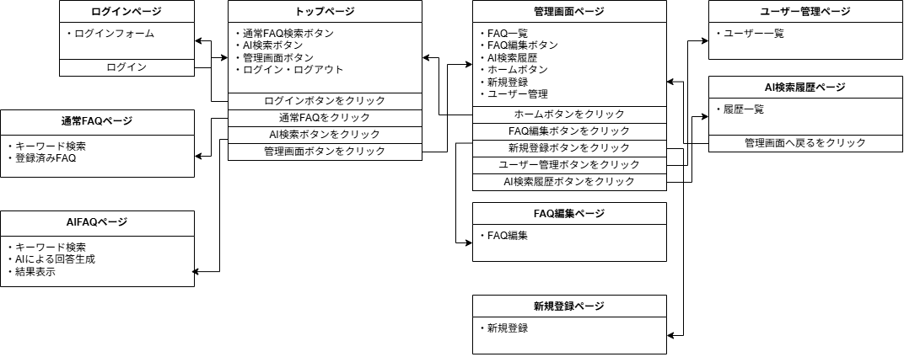
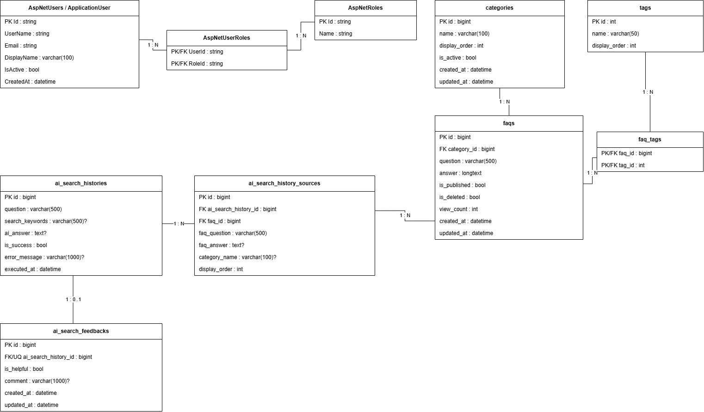
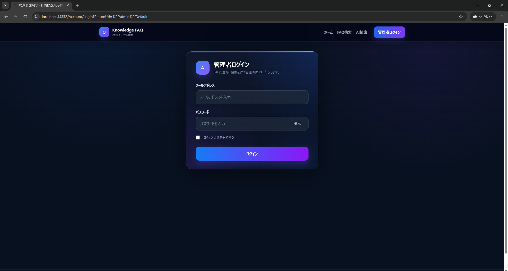
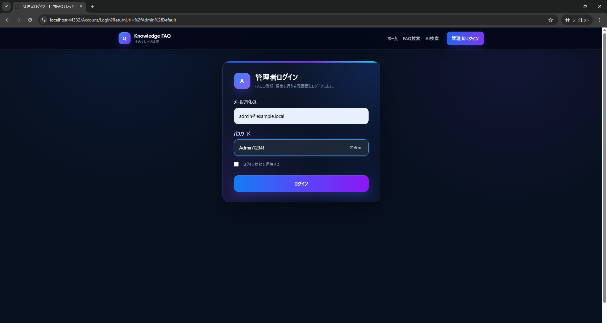
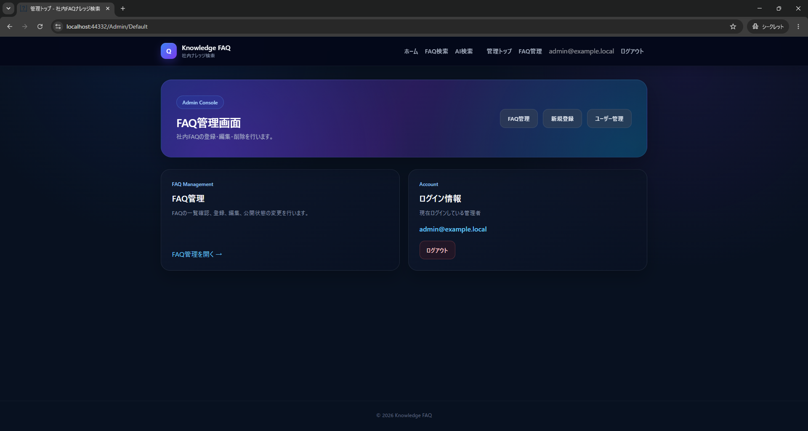

# 基本設計書

**社内FAQ・業務ナレッジ検索アプリ — ASP.NET Web Forms版**  
**FAQ Knowledge Search - ASP.NET Web Forms**

| 項目 | 内容 |
|---|---|
| プロジェクト名 | 社内FAQ・業務ナレッジ検索アプリ |
| 対象システム | ASP.NET Web Forms版 |
| ドキュメント種別 | 基本設計書 |
| バージョン | 1.0 |
| 作成日 | 2026/07/16 |
| 更新日 | 2026/07/16 |
| 作成者 | — |
| 承認者 | — |

---

## 改訂履歴

| バージョン | 日付 | 変更内容 | 作成者 |
|---|---|---|---|
| 1.0 | 2026/07/16 | Web Forms版の要件定義、現行画面、Service実装、認証設定、ER図および画面遷移図を基に初版作成 | — |

---

## 1. 本書の目的

本書は、社内FAQ・業務ナレッジ検索アプリのASP.NET Web Forms版について、システム構成、画面、機能、認証・認可、データ、外部サービス連携、エラー処理、非機能およびテスト方針を定義することを目的とする。

本書は、要件定義書と実装の中間に位置する基本設計書として、画面単位および機能単位の責務と主要な処理ルールを整理する。個々のクラス、メソッド、SQL、コントロールIDなどの実装詳細は、詳細設計書またはソースコードを参照する。

---

## 2. システム概要

### 2.1 目的

本システムは、社内業務アプリに関する操作手順、障害対応、APIエラー、CSV取込、PDF出力、メール通知、月次処理などのFAQを一元管理し、通常FAQ検索およびAI FAQ検索から必要な情報を確認できるWebアプリケーションである。

一般利用者は、公開済みFAQの検索・閲覧およびAI FAQ検索を利用する。管理者は、FAQ管理、AI検索履歴確認、ユーザー状態管理を行う。

AI FAQ検索では、登録済みの公開FAQを検索し、関連FAQをコンテキストとしてOpenAI APIへ渡して回答を生成する。回答には参照元FAQを表示し、AI回答の根拠を確認できるようにする。

### 2.2 ASP.NET Web Forms版の位置付け

本Web Forms版は、同一テーマのNext.js + ASP.NET Core Web API版と業務要件を共通化しつつ、以下の技術構成を確認するための比較実装である。

- ASP.NET Web Formsによるサーバーサイド一体型構成
- ASPX、CodeBehind、Master Page、UserControlによる画面構築
- ASP.NET Identity 2とOWIN Cookie Authenticationによる認証
- Adminロールによる管理画面の認可
- Service、DTO、Entity、DbContextによる責務分離
- Entity Framework 6によるMySQLアクセス
- Web Forms環境からのOpenAI API連携

本Web Forms版はローカル実行を前提とし、公開デモは運用・保守対象の重複を避けるため、Next.js + ASP.NET Core版へ集約する。

公開デモ：<https://faq-knowledge-search.vercel.app/>

### 2.3 想定利用者

| 利用者 | 主な利用内容 |
|---|---|
| 一般利用者 | 公開FAQの検索・閲覧、AI FAQ検索、AI回答フィードバック |
| FAQ管理者 | FAQの登録、編集、公開・非公開管理、論理削除 |
| システム管理者 | AI検索履歴確認、ユーザー有効・無効管理 |

### 2.4 主な利用シーン

| シーン | 内容 |
|---|---|
| 業務アプリの操作確認 | 登録済みFAQから操作手順を検索する |
| 障害一次対応 | エラーや障害に関する過去の対応方法を検索する |
| 月次処理確認 | 月次締め、CSV取込、PDF出力などの手順を確認する |
| AIによる確認支援 | 自然文で質問し、FAQを根拠に生成された回答を確認する |
| FAQ管理 | 管理者がFAQの登録、編集、公開状態変更、論理削除を行う |
| 利用状況確認 | 管理者がAI検索履歴、参照元、成否、評価を確認する |

---

## 3. 対象範囲

### 3.1 実装対象

| 分類 | 対象機能 |
|---|---|
| 一般機能 | トップ、FAQ検索、FAQ詳細、AI FAQ検索、参照元FAQ表示、フィードバック |
| 管理機能 | 管理者ログイン、管理トップ、FAQ一覧、新規登録、編集、公開状態管理、論理削除 |
| 履歴管理 | AI検索履歴一覧、履歴詳細、成功・失敗・参照元・評価の確認 |
| ユーザー管理 | ユーザー一覧、有効・無効切り替え |
| 認証・認可 | ASP.NET Identity 2、OWIN Cookie認証、Adminロール判定 |
| データアクセス | Entity Framework 6、MySQL |
| 外部連携 | OpenAI API |
| 品質 | Service層ユニットテスト、認証・認可のブラウザ操作確認、GitHub Actions |

### 3.2 対象外・今後の拡張候補

- 公開ホスティング
- FAQのCSV一括登録
- FAQへのファイル・画像添付
- カテゴリ・タグ管理画面
- 通常FAQ検索履歴
- FAQ作成者・更新者の記録
- 監査ログ
- ユーザーロール変更
- Editorロール
- 利用状況ダッシュボード
- E2Eテストの自動化
- IIS本番配置手順

---

## 4. システム構成

### 4.1 技術構成

| 区分 | 技術・方式 |
|---|---|
| 言語 | C# |
| Webフレームワーク | ASP.NET Web Forms |
| 実行基盤 | .NET Framework 4.8 |
| 画面 | ASPX / CodeBehind / Master Page / UserControl |
| ORM | Entity Framework 6 |
| Database | MySQL 8 |
| 認証 | ASP.NET Identity 2 |
| 認証方式 | OWIN Cookie Authentication |
| 認可 | Adminロール、管理画面共通基底ページ |
| AI | OpenAI API |
| HTTPクライアント | `HttpClient` |
| JSON | Newtonsoft.Json |
| UI | Bootstrap 5 / jQuery |
| ローカル実行 | Visual Studio 2022 / IIS Express |
| DB実行環境 | Docker / MySQL |
| CI | GitHub Actions |

### 4.2 全体アーキテクチャ

```text
[User Browser]
      |
      | HTTP / PostBack
      v
[ASP.NET Web Forms]
      |
      | ASPX / CodeBehind
      v
[Service / DTO]
      |
      | Entity Framework 6
      v
[MySQL Database]

AI検索時：

[AI Search Service]
      |
      | HTTPS / JSON
      v
[OpenAI API]
```

### 4.3 アプリケーション内の責務分離

```text
ASPX
  ↓
CodeBehind
  ↓
Service
  ↓
DTO / Entity
  ↓
DbContext
  ↓
MySQL
```

| 要素 | 主な責務 |
|---|---|
| ASPX | 画面レイアウト、入力項目、サーバーコントロールの定義 |
| CodeBehind | ページライフサイクル、イベント処理、入力値受け取り、Service呼び出し、画面制御 |
| Service | FAQ検索・更新、AI検索、履歴保存、フィードバック、ユーザー状態管理などの業務処理 |
| DTO | 画面表示データおよび入力データの受け渡し |
| Entity | DBへ永続化するデータモデル |
| DbContext | Entity Framework 6による検索・登録・更新 |
| Identity | ユーザー、ロール、パスワード、ロックアウト、SecurityStamp管理 |
| OWIN | Cookie認証ミドルウェアの構成と認証Cookie管理 |

### 4.4 主なService構成

| Service | 主な責務 |
|---|---|
| `FaqService` | 公開FAQ検索、FAQ詳細、管理者検索、FAQ登録・編集・論理削除、カテゴリ・タグ取得 |
| `AdminUserService` | ユーザー一覧のページ取得、有効・無効状態変更 |
| `AiService` | AI検索全体の制御、FAQ抽出、API呼び出し、結果整形、履歴保存 |
| `AiApiClient` | OpenAI APIへのHTTPリクエストと回答抽出 |
| `AiSearchHistoryService` | AI検索成功・失敗履歴と参照元FAQの保存 |
| `AiSearchHistoryQueryService` | AI検索履歴の検索、一覧・詳細表示用データ取得 |
| `AiSearchFeedbackService` | AI検索履歴に対する評価とコメントの保存・更新 |

---

## 5. 利用者・権限設計

### 5.1 利用者区分

| 区分 | 認証 | 主な利用機能 |
|---|---|---|
| 未認証・一般利用者 | 不要 | トップ、公開FAQ検索、公開FAQ詳細、AI FAQ検索、フィードバック |
| 一般ユーザー | Cookie認証の対象になり得るがAdmin権限なし | 一般利用者向け機能。管理画面ログイン不可 |
| Adminユーザー | 必須 | 管理トップ、FAQ管理、AI検索履歴、ユーザー管理 |
| 無効ユーザー | 認証不可とする設計方針 | 利用不可。無効化時にSecurityStampを更新する |

### 5.2 認可方針

- 管理画面はAdminロールを持つユーザーのみ利用可能とする。
- 管理画面への未認証アクセスは、ログイン画面へリダイレクトする。
- ログイン画面では、メールアドレスとパスワードが正しくてもAdminロールを持たないユーザーのログインを許可しない。
- 管理画面の共通認可処理は、管理画面用基底ページへ集約する。
- Adminユーザーの有効・無効状態は、ユーザー管理画面から変更できない。

---

## 6. 画面一覧

| ID | 画面名 | URL | 利用者 | 認証 |
|---|---|---|---|---|
| S-001 | トップ画面 | `/Default.aspx` | 全員 | 不要 |
| S-002 | FAQ検索画面 | `/Faqs/Index.aspx` | 全員 | 不要 |
| S-003 | FAQ詳細画面 | `/Faqs/Detail.aspx?id={id}` | 全員 | 不要 |
| S-004 | AI FAQ検索画面 | `/AiSearch/Index.aspx` | 全員 | 不要 |
| S-005 | 管理者ログイン画面 | `/Account/Login.aspx` | 管理者 | 不要 |
| S-006 | ログアウト確認画面 | `/Account/Logout.aspx` | 認証済み管理者 | 必須 |
| S-007 | 管理トップ画面 | `/Admin/Default.aspx` | 管理者 | 必須 |
| S-008 | 管理者FAQ一覧画面 | `/Admin/Faqs/Index.aspx` | 管理者 | 必須 |
| S-009 | FAQ新規登録・編集画面 | `/Admin/Faqs/Edit.aspx` | 管理者 | 必須 |
| S-010 | AI検索履歴一覧画面 | `/Admin/AiHistories/Index.aspx` | 管理者 | 必須 |
| S-011 | AI検索履歴詳細画面 | `/Admin/AiHistories/Detail.aspx?id={id}` | 管理者 | 必須 |
| S-012 | ユーザー管理画面 | `/Admin/Users/Index.aspx` | 管理者 | 必須 |
| S-013 | 403エラー画面 | `/Error/403.aspx` | 全員 | 不要 |
| S-014 | 404エラー画面 | `/Error/404.aspx` | 全員 | 不要 |
| S-015 | 500エラー画面 | `/Error/500.aspx` | 全員 | 不要 |

---

## 7. 画面遷移

### 7.1 一般利用者向け画面遷移

トップ画面から通常FAQ検索、FAQ詳細、AI FAQ検索へ遷移する。管理画面へアクセスした場合は、管理者ログイン画面へ遷移する。


### 7.2 管理者向け画面遷移

管理者はログイン後、管理トップからFAQ管理、AI検索履歴、ユーザー管理へ遷移する。FAQ一覧から新規登録画面および編集画面へ遷移する。



### 7.3 認証時の遷移

```text
管理画面へアクセス
      ↓
未認証
      ↓
/Account/Login.aspx?ReturnUrl=...
      ↓
認証情報を入力
      ↓
ユーザー・パスワード・ロックアウト・Adminロールを確認
      ↓
認証Cookie発行
      ↓
安全なReturnUrlがあれば元画面へ遷移
      ↓
ReturnUrlがない場合は /Admin/Default.aspx
```

外部URLへのオープンリダイレクトを防ぐため、`ReturnUrl`はアプリケーション内のローカルURLのみ受け付ける。

---

## 8. 画面基本設計

### 8.1 トップ画面

| 項目 | 内容 |
|---|---|
| 目的 | アプリケーション概要と主要機能への導線を表示する |
| 利用者 | 全員 |
| 主な表示 | 通常FAQ検索、AI FAQ検索、管理画面へのリンク |
| 主な操作 | 各機能への画面遷移 |
| 認証 | 不要 |

### 8.2 FAQ検索画面

| 項目 | 内容 |
|---|---|
| 目的 | 公開中のFAQをキーワードで検索する |
| 利用者 | 全員 |
| 入力 | キーワード |
| 検索対象 | 質問、回答、カテゴリ名、タグ名 |
| 表示対象 | 公開済み、未削除、有効カテゴリのFAQ |
| 表示項目 | 質問、回答抜粋、カテゴリ、タグ、閲覧数、更新日時 |
| 並び順 | 更新日時降順、同一日時の場合はID降順 |
| 遷移 | FAQ詳細画面、トップ画面 |
| Service | `IFaqService.SearchPublishedFaqs` |

キーワードが未入力の場合は、表示対象となる公開FAQを一覧表示する。

### 8.3 FAQ詳細画面

| 項目 | 内容 |
|---|---|
| 目的 | 選択した公開FAQの内容を表示する |
| 利用者 | 全員 |
| 入力 | FAQ ID |
| 表示条件 | 公開済み、未削除、有効カテゴリ |
| 表示項目 | 質問、回答、カテゴリ、タグ、閲覧数、更新日時 |
| 更新処理 | 詳細表示成功時に閲覧数を1加算する |
| 異常時 | ID不正または対象なしの場合は未存在として扱う |
| Service | `IFaqService.GetPublishedFaqById` |

### 8.4 AI FAQ検索画面

| 項目 | 内容 |
|---|---|
| 目的 | 自然文の質問に対し、FAQを根拠にAI回答を生成する |
| 利用者 | 全員 |
| 入力 | 質問文 |
| 入力制約 | 必須、500文字以内 |
| 出力 | AI回答、注意文、参照元FAQ、メッセージ、履歴ID |
| 参照FAQ数 | 設定値。未設定または不正値の場合は5件 |
| FAQ0件時 | OpenAI APIを呼び出さず、該当FAQなしのメッセージを表示する |
| API失敗時 | 固定エラーメッセージを表示し、参照元FAQを表示する |
| Service | `IAiService.SearchAsync` |

### 8.5 管理者ログイン画面

| 項目 | 内容 |
|---|---|
| 目的 | Adminユーザーを認証し、管理画面へ遷移させる |
| 入力 | メールアドレス、パスワード、ログイン状態保持 |
| 入力検証 | ASP.NET Web Formsのページ検証を利用する |
| 認証確認 | ユーザー存在、ロックアウト状態、パスワード、Adminロール |
| 成功時 | 認証Cookieを発行し、ReturnUrlまたは管理トップへ遷移 |
| 失敗時 | 認証エラーメッセージを表示 |
| セキュリティ | ユーザー不存在、パスワード不一致、権限不足を原則同一メッセージで通知 |

パスワード不一致時はアクセス失敗回数を加算する。ロックアウトに到達した場合は、一定時間後の再試行を促すメッセージを表示する。ログイン成功時はアクセス失敗回数をリセットする。

### 8.6 ログアウト確認画面

| 項目 | 内容 |
|---|---|
| 目的 | 管理者が確認後にログアウトする |
| 利用者 | 認証済み管理者 |
| 処理 | 認証Cookieの無効化、Sessionクリア、Session破棄、キャッシュ抑止 |
| 遷移 | トップ画面 |
| 未認証時 | 直接トップ画面へ遷移 |

### 8.7 管理トップ画面

| 項目 | 内容 |
|---|---|
| 目的 | 管理者向け機能のメニューを表示する |
| 利用者 | 管理者 |
| 主な導線 | FAQ管理、AI検索履歴、ユーザー管理、ログアウト |
| 認証 | 必須 |

### 8.8 管理者FAQ一覧画面

| 項目 | 内容 |
|---|---|
| 目的 | 未削除FAQを検索・一覧表示し、管理操作へ遷移する |
| 入力 | キーワード、公開状態 |
| 検索対象 | 質問、回答、カテゴリ名、タグ名 |
| 表示対象 | 未削除FAQ。公開・非公開の両方 |
| 表示項目 | FAQ ID、質問、カテゴリ、公開状態、閲覧数、更新日時など |
| 並び順 | 更新日時降順、同一日時の場合はID降順 |
| 主な操作 | 検索、新規登録、編集、削除 |
| Service | `IFaqService.SearchFaqsForAdmin` |

### 8.9 FAQ新規登録・編集画面

| 項目 | 内容 |
|---|---|
| 目的 | FAQの新規登録または既存FAQの編集を行う |
| 利用者 | 管理者 |
| 入力 | カテゴリ、質問、回答、タグ、公開状態 |
| 入力制約 | カテゴリ必須、質問必須・500文字以内、回答必須 |
| カテゴリ | 新規登録では有効カテゴリのみ選択可能 |
| 編集時カテゴリ | 現在のカテゴリが無効でも、同じカテゴリを維持する編集は可能 |
| タグ | 複数選択可。重複IDを除外し、存在しないタグIDはエラー |
| 新規登録時 | 閲覧数0、未削除として登録 |
| 更新時 | FAQ項目を更新し、タグ関連を選択内容で再設定 |
| Service | `CreateFaq`、`UpdateFaq`、`GetFaqForAdmin`、`GetCategoryOptions`、`GetTagOptions` |

### 8.10 AI検索履歴一覧画面

| 項目 | 内容 |
|---|---|
| 目的 | AI検索の実行履歴を検索・一覧表示する |
| 利用者 | 管理者 |
| 入力 | キーワード、成功・失敗状態 |
| 検索対象 | 質問、検索キーワード、AI回答、エラーメッセージ |
| 表示項目 | 質問、回答プレビュー、成否、参照元件数、評価、実行日時 |
| 回答プレビュー | 改行を空白へ置換し、120文字を超える場合は省略記号を付与 |
| 並び順 | 実行日時降順、同一日時の場合はID降順 |
| 遷移 | AI検索履歴詳細画面 |
| Service | `IAiSearchHistoryQueryService.SearchHistories` |

### 8.11 AI検索履歴詳細画面

| 項目 | 内容 |
|---|---|
| 目的 | 1件のAI検索履歴の質問、回答、成否、参照元、評価を確認する |
| 利用者 | 管理者 |
| 入力 | AI検索履歴ID |
| 表示項目 | 質問、検索キーワード、AI回答、エラー、成否、評価、実行日時、参照元FAQ |
| 参照元表示順 | `DisplayOrder`、同順位の場合はID順 |
| FAQリンク | `/Faqs/Detail.aspx?id={FaqId}` |
| Service | `IAiSearchHistoryQueryService.GetHistoryById` |

### 8.12 ユーザー管理画面

| 項目 | 内容 |
|---|---|
| 目的 | Identityユーザーを一覧表示し、一般ユーザーの有効・無効を変更する |
| 利用者 | 管理者 |
| 表示項目 | 表示名、メールアドレス、代表ロール、有効状態、作成日時 |
| 並び順 | 作成日時降順、表示名、メールアドレス順 |
| ページング | ページ番号は1以上。1回の取得件数は1～100件に補正 |
| ロール表示 | Adminを優先し、それ以外は名称順の先頭。未割当は「未割当」 |
| 状態変更 | 一般ユーザーのみ有効・無効変更可能 |
| Admin制約 | Adminロールを持つユーザーは状態変更不可 |
| 無効化時 | SecurityStampを更新する |
| Service | `IAdminUserService.GetPage`、`SetActiveAsync` |

---

## 9. FAQ機能設計

### 9.1 一般FAQ検索

1. キーワードの前後空白を除去する。
2. 公開済み、未削除、有効カテゴリのFAQを対象とする。
3. キーワードがある場合は、質問、回答、カテゴリ名、タグ名の部分一致で絞り込む。
4. 更新日時降順、ID降順で取得する。
5. タグは表示順、ID順に並べて表示用文字列へ変換する。

### 9.2 FAQ詳細取得

1. FAQ IDが0以下の場合は未存在として扱う。
2. 公開済み、未削除、有効カテゴリのFAQを1件取得する。
3. 対象が存在する場合は閲覧数を1加算して保存する。
4. FAQ、カテゴリ、タグを表示用DTOへ変換する。

### 9.3 管理者FAQ検索

1. 未削除FAQを対象とする。
2. キーワードがある場合は、質問、回答、カテゴリ名、タグ名の部分一致で絞り込む。
3. 公開状態が指定されている場合は、公開・非公開で絞り込む。
4. 更新日時降順、ID降順で表示する。

### 9.4 FAQ登録

1. 入力DTOの存在を確認する。
2. カテゴリ、質問、回答を検証する。
3. 質問はトリムし、500文字以内とする。
4. 選択カテゴリが有効であることを確認する。
5. 選択タグの重複を除外し、すべて存在することを確認する。
6. 公開状態を入力値から設定し、未削除、閲覧数0で登録する。
7. 作成日時と更新日時を設定する。
8. タグ関連を登録して保存する。

### 9.5 FAQ編集

1. FAQ IDと入力値を検証する。
2. 未削除の対象FAQを取得する。
3. 現カテゴリが無効の場合は、同カテゴリを維持する編集のみ許可する。
4. 質問、回答、カテゴリ、公開状態を更新する。
5. 既存タグ関連を解除し、選択タグを再設定する。
6. 更新日時を設定して保存する。

### 9.6 FAQ論理削除

1. 未削除の対象FAQを取得する。
2. `IsDeleted`をtrueへ変更する。
3. `IsPublished`をfalseへ変更する。
4. 更新日時を設定して保存する。
5. 物理削除は行わない。

---

## 10. AI FAQ検索設計

### 10.1 処理フロー

```text
質問入力
   ↓
入力値検証
   ↓
公開FAQ検索
   ↓
関連FAQを設定件数まで抽出
   ↓
FAQ0件？
   ├─ Yes → 失敗履歴保存 → 案内メッセージ返却
   └─ No
        ↓
FAQコンテキスト作成
        ↓
OpenAI API呼び出し
        ↓
成功？
   ├─ Yes → 成功履歴・参照元保存 → 回答返却
   └─ No  → 固定エラー履歴保存 → 参照元付きエラー返却
```

### 10.2 入力検証

| 条件 | 処理 |
|---|---|
| 未入力・空白のみ | 「質問文を入力してください。」を返し、履歴を保存しない |
| 500文字超過 | 「質問文は500文字以内で入力してください。」を返し、履歴を保存しない |
| 正常 | FAQ検索へ進む |

### 10.3 関連FAQの抽出

- `FaqService.SearchPublishedFaqs`の検索結果を利用する。
- 最大件数は`AiMaxContextFaqCount`を使用する。
- 設定値が0以下または解析できない場合は5件を使用する。
- 現行実装では全文検索やベクトル検索ではなく、質問文をキーワードとしてFAQ検索へ渡す。
- 抽出されたFAQは、カテゴリ、タグ、質問、回答を含むコンテキストへ整形する。

### 10.4 FAQ0件時

- OpenAI APIは呼び出さない。
- 「該当するFAQが見つかりませんでした。」を失敗履歴へ保存する。
- 利用者には、キーワードを変更して再検索するよう案内する。

### 10.5 API成功時

- AI回答、注意文、参照元FAQ、履歴IDを返す。
- 注意文として、FAQを基に生成された回答であり参照元確認が必要であることを表示する。
- AI回答と参照元FAQを成功履歴として保存する。
- 履歴保存に失敗した場合も、AI回答自体は利用者へ返す。

### 10.6 API失敗時

- 例外の詳細はトレースへ出力する。
- APIレスポンス全文や認証情報をDBへ保存しない。
- 履歴には「AI回答の生成に失敗しました。」という固定メッセージを保存する。
- 利用者には、参照元FAQを確認するよう案内する。
- API失敗時も、検索済みの参照元FAQを表示する。

### 10.7 AI回答ガードレール

OpenAI APIへ次の回答方針を指示する。

- 提供されたFAQコンテキストのみを根拠に回答する。
- FAQに記載されていない内容を断言しない。
- FAQにない手順、原因、担当部署、問い合わせ先を推測しない。
- 機密情報、個人情報、認証情報を出力しない。
- 利用者向けに簡潔で分かりやすい日本語で回答する。
- 回答末尾に「詳細は参照元FAQをご確認ください。」を付与する。
- 根拠がない場合は「該当するFAQからは判断できません。」と回答する。

---

## 11. AI検索履歴・フィードバック設計

### 11.1 履歴保存

| 項目 | 方針 |
|---|---|
| 成功履歴 | 質問、検索キーワード、AI回答、成功状態、実行日時、参照元FAQを保存 |
| 失敗履歴 | 質問、検索キーワード、失敗状態、エラーメッセージ、実行日時、参照元FAQを保存 |
| 質問 | トリムし、500文字を超える場合は500文字へ切り詰める |
| 検索キーワード | 現行実装では質問文と同じ値を保存する |
| エラーメッセージ | 最大1,000文字。未指定の場合は固定メッセージ |
| 実行日時 | UTCで保存する |

### 11.2 参照元FAQのスナップショット

AI回答生成時に利用したFAQについて、以下を履歴の参照元として保存する。

- FAQ ID
- FAQ質問
- FAQ回答
- カテゴリ名
- 表示順

同一FAQが重複して渡された場合は、FAQ ID単位で重複を除外する。質問は最大500文字、カテゴリ名は最大100文字へ正規化する。

### 11.3 履歴検索

- 質問、検索キーワード、AI回答、エラーメッセージをキーワード検索対象とする。
- 成功・失敗状態で絞り込める。
- 実行日時降順、ID降順で取得する。
- 履歴ごとの評価をまとめて取得し、一覧に表示する。

### 11.4 フィードバック

| 項目 | 方針 |
|---|---|
| 対象 | 存在するAI検索履歴 |
| 評価 | 役に立った / 役に立たなかった |
| コメント | 任意、最大1,000文字 |
| 件数 | 1履歴につき最大1件 |
| 再評価 | 既存レコードを更新する |
| 日時 | 作成日時・更新日時をUTCで保存する |

---

## 12. ユーザー管理設計

### 12.1 一覧取得

- ページ番号は1以上へ補正する。
- ページサイズは1以上、最大100へ補正する。
- 指定ページが最終ページを超える場合は、最終ページへ補正する。
- 作成日時降順、表示名、メールアドレス順で取得する。
- 表示名が未設定の場合は「未設定」と表示する。
- メールアドレスが未設定の場合はユーザー名を表示する。
- ロール未割当の場合は「未割当」と表示する。

### 12.2 代表ロール表示

- 複数ロールがある場合はAdminロールを優先する。
- Adminがない場合はロール名の昇順で先頭を表示する。

### 12.3 有効・無効状態変更

1. ユーザーIDが指定されていることを確認する。
2. 対象ユーザーを取得する。
3. 対象がAdminロールの場合は変更を拒否する。
4. 現在値と指定値が同じ場合は更新せず成功扱いとする。
5. `IsActive`を更新する。
6. 無効化する場合はSecurityStampを更新する。
7. IdentityのUserManagerを介して保存する。

---

## 13. 認証・認可設計

### 13.1 Cookie認証設定

| 項目 | 設定 |
|---|---|
| 認証方式 | OWIN Cookie Authentication |
| AuthenticationType | `ApplicationCookie` |
| Cookie名 | `.FaqKnowledgeSearch.Auth` |
| ログインパス | `/Account/Login.aspx` |
| 有効期間 | 30分 |
| SlidingExpiration | 有効 |
| HttpOnly | 有効 |
| Secure | リクエストがHTTPSの場合に付与 |
| SecurityStamp検証 | 30分ごと |

### 13.2 ログイン処理

1. Web Formsの入力検証結果を確認する。
2. メールアドレスでユーザーを検索する。
3. ロックアウト状態を確認する。
4. パスワードを検証する。
5. 不一致時はアクセス失敗回数を加算する。
6. Adminロールを確認する。
7. 成功時は失敗回数をリセットする。
8. 既存のApplicationCookieをサインアウトする。
9. 新しい認証Identityを発行してサインインする。
10. Remember Meの選択をCookie永続化へ反映する。
11. 安全なReturnUrlまたは管理トップへ遷移する。

### 13.3 エラーメッセージ方針

- ユーザー不存在、パスワード不一致、Adminロールなしは、原則として「メールアドレスまたはパスワードが正しくありません。」と表示する。
- ロックアウト時のみ、試行回数上限に達した旨を通知する。
- 表示メッセージはHTMLエンコードして出力する。

### 13.4 ログアウト処理

- ApplicationCookieをサインアウトする。
- Sessionをクリア・破棄する。
- レスポンスをキャッシュさせない。
- トップ画面へ遷移する。

---

## 14. データベース基本設計

### 14.1 主なテーブル

| テーブル | 用途 |
|---|---|
| `categories` | FAQカテゴリ |
| `faqs` | FAQ質問、回答、公開状態、削除状態、閲覧数など |
| `tags` | FAQへ付与するタグ |
| `faq_tags` | FAQとタグの多対多を管理する中間テーブル |
| `ai_search_histories` | AI検索の質問、回答、成否、エラー、実行日時 |
| `ai_search_history_sources` | AI回答生成時に利用したFAQのスナップショット |
| `ai_search_feedbacks` | AI検索履歴に対する評価とコメント |
| `AspNetUsers` | ASP.NET Identityユーザー |
| `AspNetRoles` | ASP.NET Identityロール |
| `AspNetUserRoles` | ユーザーとロールの関連 |

### 14.2 ER図



### 14.3 主な関連

```text
categories 1 ─── N faqs

faqs N ─── N tags
       faq_tags

ai_search_histories 1 ─── N ai_search_history_sources

faqs 1 ─── N ai_search_history_sources

ai_search_histories 1 ─── 0..1 ai_search_feedbacks

AspNetUsers N ─── N AspNetRoles
             AspNetUserRoles
```

### 14.4 データ保持方針

| データ | 方針 |
|---|---|
| FAQ | 物理削除せず、削除フラグによる論理削除 |
| 非公開FAQ | DBに保持し、一般利用者には表示しない |
| AI検索履歴 | 成功・失敗を問わず原則保持 |
| 参照元FAQ | 回答生成時点の質問、回答、カテゴリ名をスナップショット保存 |
| フィードバック | 1履歴1件。再評価時は更新 |
| ユーザー | 原則削除せず、有効・無効状態で管理 |
| APIキー | DBへ保存しない |

---

## 15. 外部インターフェース設計

### 15.1 OpenAI API

| 項目 | 内容 |
|---|---|
| 用途 | FAQコンテキストに基づくAI回答生成 |
| 通信 | HTTPS |
| HTTPメソッド | POST |
| 認証 | Bearerトークン |
| Content-Type | `application/json` |
| タイムアウト | 30秒 |
| モデル | 設定ファイルから取得 |
| 出力上限 | 1,000トークン |
| 呼び出し元 | `AiApiClient` |

### 15.2 リクエスト概要

リクエストには、以下を設定する。

- モデル
- システム指示
- 利用者の質問とFAQコンテキスト
- 最大出力トークン数

### 15.3 レスポンス処理

- APIレスポンスの`output`配列から、`type = output_text`のテキストを抽出する。
- 複数テキストがある場合は改行で結合する。
- HTTPステータスが成功でない場合は、利用者向けの固定例外へ変換する。
- 回答本文が取得できない場合はエラーとする。

---

## 16. 設定管理

### 16.1 Web.config構成

| 設定 | 方針 |
|---|---|
| Target Framework | .NET Framework 4.8 |
| ASP.NET標準認証 | `None`。認証はOWINで行う |
| 接続文字列 | `connectionStrings.config`へ外部化 |
| AppSettings | `appSettings.local.config`へ外部化 |
| Entity Framework | EF6、MySQL Providerを登録 |
| カスタムエラー | リモートアクセス時に500・404エラーページへ誘導 |

### 16.2 AI設定

| 設定キー | 内容 | 既定値・優先順位 |
|---|---|---|
| `FAQ_AI_API_KEY` | APIキーの環境変数 | 最優先 |
| `AiApiKey` | APIキーのAppSettings | 環境変数がない場合 |
| `AiApiEndpoint` | APIエンドポイント | 必須 |
| `AiModel` | 利用モデル | 必須 |
| `AiMaxContextFaqCount` | AIへ渡すFAQ最大件数 | 未設定・不正・0以下の場合は5 |

### 16.3 機密情報管理

- APIキー、DBパスワード、接続文字列をソースコードへ直接記述しない。
- ローカル設定ファイルはGit管理対象外とする。
- READMEや設計書へ認証情報を掲載しない。
- サンプル設定には実値を含めない。

---

## 17. エラー・メッセージ設計

### 17.1 エラーページ

| ステータス | 画面 | 用途 |
|---|---|---|
| 403 | `/Error/403.aspx` | 認証済みだが権限がない場合 |
| 404 | `/Error/404.aspx` | ページまたは対象データが存在しない場合 |
| 500 | `/Error/500.aspx` | 予期しないアプリケーションエラー |

### 17.2 Web.configのエラー方針

- `customErrors`は`RemoteOnly`とする。
- リモートアクセス時の未処理エラーは500画面へ誘導する。
- 404は404画面へ誘導する。
- 本番相当環境ではスタックトレースや内部例外を利用者へ表示しない。

### 17.3 主な業務エラー

| 機能 | 条件 | メッセージ例 |
|---|---|---|
| FAQ登録・編集 | カテゴリ未選択 | カテゴリを選択してください。 |
| FAQ登録・編集 | 質問未入力 | 質問を入力してください。 |
| FAQ登録・編集 | 質問500文字超過 | 質問は500文字以内で入力してください。 |
| FAQ登録・編集 | 回答未入力 | 回答を入力してください。 |
| FAQ登録・編集 | カテゴリ使用不可 | 選択されたカテゴリは使用できません。 |
| FAQ登録・編集 | タグ不存在 | 選択されたタグの一部が存在しません。 |
| AI検索 | 質問未入力 | 質問文を入力してください。 |
| AI検索 | 質問500文字超過 | 質問文は500文字以内で入力してください。 |
| AI検索 | FAQ0件 | 該当するFAQが見つかりませんでした。 |
| AI検索 | API失敗 | AI回答の生成に失敗しました。参照元FAQをご確認ください。 |
| フィードバック | 履歴不存在 | 評価対象のAI検索履歴が存在しません。 |
| ユーザー管理 | Admin変更 | Adminユーザーの有効・無効は変更できません。 |

---

## 18. 非機能設計

### 18.1 セキュリティ

- パスワード管理にはASP.NET Identity 2を利用する。
- 管理機能はAdminロールへ限定する。
- 認証CookieはHttpOnlyとする。
- HTTPS通信時はCookieへSecure属性を付与する。
- SecurityStampを定期検証し、Identity変更を認証Cookieへ反映する。
- `ReturnUrl`はローカルURLのみ許可する。
- ログインエラーからユーザー存在や権限有無を推測しにくいメッセージとする。
- Entity Framework 6を利用し、SQL文字列の直接組み立てを避ける。
- 出力時はWeb Formsのエンコード機構または明示的HTMLエンコードを利用する。
- APIキー、接続文字列、認証情報をGitへ登録しない。
- AI履歴へAPIレスポンス全文や認証情報を保存しない。

### 18.2 パフォーマンス

- 一覧取得では`AsNoTracking`を利用し、更新不要なEntityの追跡を抑制する。
- 関連データは必要な画面で`Include`を利用して取得する。
- ユーザー一覧はページングする。
- AIコンテキストへ渡すFAQ件数を設定値で制限する。
- OpenAI APIのHTTPタイムアウトを30秒とする。
- AI履歴一覧の評価は、履歴単位の逐次照会ではなくまとめて取得する。

### 18.3 可用性・障害時動作

- AI APIが失敗しても、検索済みの参照元FAQを利用者へ提示する。
- AI履歴保存が失敗しても、生成済み回答の返却を継続する。
- FAQ0件時はAI APIを呼び出さず、利用者へ再検索を案内する。
- 予期しない例外はトレースへ出力し、利用者へ内部情報を表示しない。

### 18.4 保守性

- CodeBehindから業務処理をServiceへ分離する。
- ServiceはInterfaceを定義し、テスト可能性を確保する。
- 画面表示用データはDTOへ変換する。
- 接続文字列とAI設定を外部設定へ分離する。
- データベース作成SQLを番号順で管理する。
- README、要件定義、基本設計、ER図、画面遷移図を整備する。

### 18.5 日時

- FAQの作成・更新日時は現行実装に合わせてアプリケーションサーバー時刻を利用する。
- AI検索履歴とフィードバックはUTCで保存する。
- 管理画面で必要な場合は、UTCから表示対象のタイムゾーンへ変換する。

---

## 19. テスト・CI方針

### 19.1 ユニットテスト

Service層を中心に、入力値検証と主要な処理分岐を確認する。

| 対象 | 主な確認内容 |
|---|---|
| `FaqService` | ID不正、必須入力、質問文字数、カテゴリ・タグ検証、論理削除 |
| `AdminUserService` | ユーザーID、ページ値、Adminユーザー変更不可 |
| `AiService` | 質問未入力、文字数超過、FAQ0件、API成功・失敗、履歴保存失敗 |
| `AiApiClient` | 設定不足、質問・コンテキスト未入力、応答抽出 |
| `AiSearchHistoryService` | 質問、成功回答、エラー正規化、参照元重複排除 |
| `AiSearchHistoryQueryService` | ID不正、検索条件、回答プレビュー |
| `AiSearchFeedbackService` | 履歴ID、履歴不存在、コメント正規化、既存評価更新 |

### 19.2 E2E確認

認証・認可について、ブラウザ操作で以下を確認する。

1. Admin権限を持たない一般ユーザーが管理画面へアクセスすると、ログイン画面へリダイレクトされること。
2. Adminユーザーが認証情報を入力してログインできること。
3. 認証成功後、管理トップ画面が正常表示されること。







### 19.3 CI

GitHub Actionsで、以下を自動実行する。

```text
GitHubへPush / Pull Request
        ↓
NuGetパッケージ復元
        ↓
ソリューションのビルド
        ↓
ユニットテスト実行
```

### 19.4 受入確認

| 項目 | 確認内容 |
|---|---|
| トップ | 主要機能への導線が表示される |
| FAQ検索 | 質問、回答、カテゴリ、タグで検索できる |
| FAQ詳細 | 公開FAQを表示し、閲覧数が加算される |
| FAQ登録 | 必須項目を入力して新規登録できる |
| FAQ編集 | FAQとタグを更新できる |
| FAQ削除 | 論理削除され、非公開になる |
| AI検索 | FAQを根拠にAI回答を取得できる |
| FAQ0件 | APIを呼び出さず案内が表示される |
| AI履歴 | 成功・失敗、参照元、評価を確認できる |
| ユーザー管理 | 一般ユーザーの有効・無効を変更できる |
| 認証 | Adminのみ管理画面へログインできる |

---

## 20. ローカル実行・公開方針

### 20.1 必要環境

- Windows 11
- Visual Studio 2022
- .NET Framework 4.8
- IIS Express
- Docker Desktop
- MySQL 8
- OpenAI APIキー

### 20.2 データベース初期化

以下のSQLを番号順に実行する。

```text
001-create-database.sql
002-create-core-tables.sql
003-seed-core-data.sql
004-create-tags.sql
005-seed-tags.sql
006-create-ai-search-history.sql
007-create-ai-search-feedback.sql
```

ASP.NET Identityのテーブルは、Identity用Entity Framework Migrationを適用して作成・更新する。

### 20.3 公開方針

本Web Forms版はローカル実行を前提とし、公開デモ環境を設けない。

同一テーマの公開環境を複数維持することによるホスティング、環境設定、監視、セキュリティ対応などの運用負荷を避けるため、公開デモはNext.js + ASP.NET Core版へ集約する。

画面および動作は、READMEのスクリーンショット、画面遷移図、ER図、ユニットテストおよびE2E確認結果で提示する。

---

## 21. ディレクトリ構成

```text
.
├── .github
│   └── workflows
│       └── webforms-unit-tests.yml
├── database
│   ├── 001-create-database.sql
│   ├── 002-create-core-tables.sql
│   ├── 003-seed-core-data.sql
│   ├── 004-create-tags.sql
│   ├── 005-seed-tags.sql
│   ├── 006-create-ai-search-history.sql
│   └── 007-create-ai-search-feedback.sql
├── docs
│   ├── design
│   │   └── basic-design-webforms.md
│   ├── requirements
│   │   └── requirements-webforms.md
│   └── images
│       └── webforms
├── FaqKnowledgeSearch.WebForms
│   ├── Account
│   ├── Admin
│   ├── AiSearch
│   ├── App_Start
│   ├── Data
│   ├── Dtos
│   ├── Error
│   ├── Faqs
│   ├── Identity
│   ├── Migrations
│   ├── Models
│   ├── Services
│   │   └── Ai
│   ├── Settings
│   ├── Default.aspx
│   ├── Site.Master
│   ├── Startup.cs
│   └── Web.config
├── FaqKnowledgeSearch.WebForms.UnitTests
│   └── Services
├── FaqKnowledgeSearch.WebForms.sln
└── README.md
```

---

## 22. 関連ドキュメント

- `README.md`
- `docs/requirements/requirements-webforms.md`
- `docs/design/basic-design-webforms.md`
- Web Forms版ER図
- 一般利用者向け画面遷移図
- 管理者向け画面遷移図
- Next.js + ASP.NET Core版の要件定義書・基本設計書・詳細設計書

---

## 23. 補足

本書は、提供されたService実装、認証・ログアウト処理、OWIN設定、AI設定、Web.config、画面キャプチャ、ER図および画面遷移図を基にした現行実装準拠の基本設計である。

次の項目は、詳細設計または各画面のCodeBehindと突合して確定する。

- 各画面のコントロールIDとイベント名
- 一覧画面で実際に指定する1ページ当たり件数
- 登録・更新・削除後の具体的な成功メッセージと遷移先
- `AdminPageBase`の詳細な403・ログイン遷移条件
- ASP.NET Identityのパスワード要件、ロックアウト回数、ロックアウト時間
- 各エラーページへ遷移する例外条件
